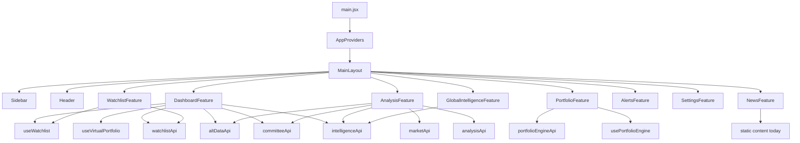
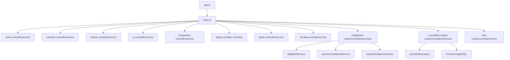
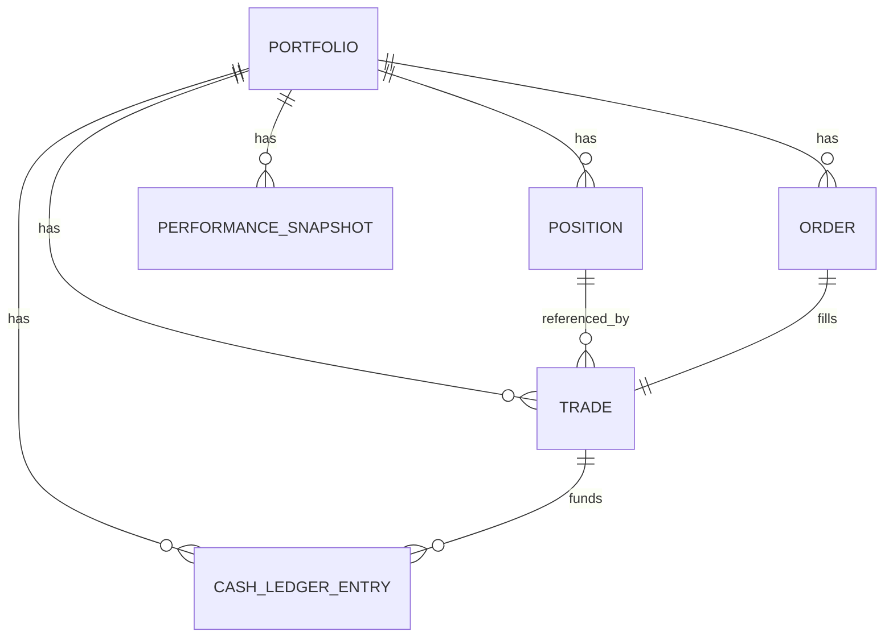
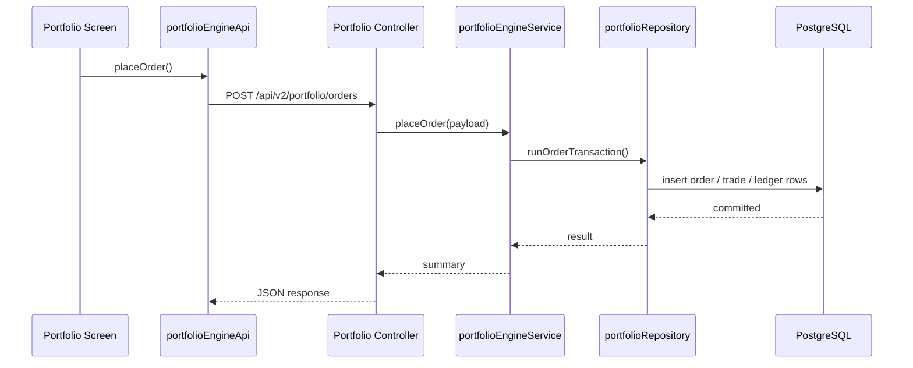
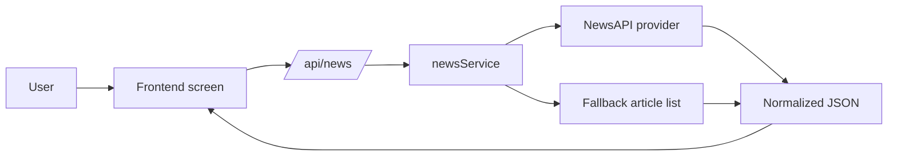
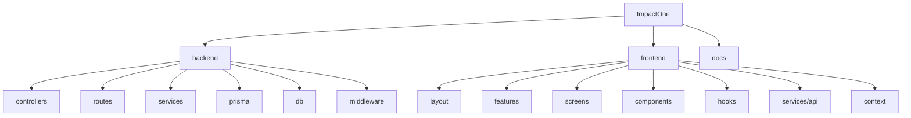
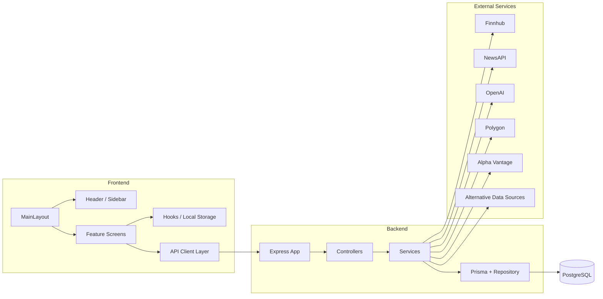

# ImpactOne Technical Architecture

**Status:** Current implementation snapshot  
**Scope:** Full MVP system architecture  
**Note:** This document describes the codebase as it exists today. Where a capability is not implemented, that gap is called out explicitly.

---

## 1. System Overview

ImpactOne is a two-tier market intelligence platform with a React/Vite frontend and an Express backend. The product is organized around three major user experiences:

- Market intelligence and AI analysis
- Autonomous global intelligence and event propagation
- Paper-trading portfolio tracking

The backend aggregates live and fallback data from market, news, AI, and alternative-data providers. The frontend consumes those APIs through a shared client layer and renders a screen-based command-center interface.

At a high level, the system works like this:

1. The user opens the React app.
2. The frontend loads watchlist state from local storage and fetches intelligence from the backend.
3. The backend calls external providers such as Finnhub, NewsAPI, OpenAI, Polygon, Alpha Vantage, and alternative-data sources.
4. The backend normalizes the results into screen-friendly JSON payloads.
5. The frontend renders dashboards, analysis views, watchlists, and portfolio pages from those payloads.

There is no dedicated authentication layer yet. The system is effectively single-tenant and local-state-driven on the frontend, with portfolio persistence handled by PostgreSQL/Prisma on the backend.

---

## 2. Frontend Architecture

### 2.1 Frontend Stack

- React
- Vite
- React Router is installed, but the current UI uses a screen-switching shell rather than route-based navigation.
- Vitest and Testing Library for client-side tests

### 2.2 Application Shell

The frontend boots from [frontend/src/main.jsx](frontend/src/main.jsx) and renders:

- `AppProviders`
- `MainLayout`

`MainLayout` is the primary shell. It composes:

- `Sidebar`
- `Header`
- The active feature screen

### 2.3 Screen Model

The app is organized as a screen map rather than separate route pages. The current active view is stored in local component state and switched through the sidebar.

Primary screens:

- Dashboard
- Global Intelligence
- AI Analysis
- Watchlist
- Portfolio
- Market News
- Alerts
- Settings

### 2.4 Feature Layer

The `features/` directory acts as a thin adapter layer between `MainLayout` and screen components.

- `DashboardFeature` -> dashboard home
- `AnalysisFeature` -> AI analysis screen
- `WatchlistFeature` -> watchlist screen
- `PortfolioFeature` -> portfolio screen
- `NewsFeature` -> market news screen
- `AlertsFeature` -> alerts screen
- `SettingsFeature` -> settings screen
- `GlobalIntelligenceFeature` is lazy-loaded for the heavier intelligence experience

### 2.5 Shared State and Hooks

Frontend state is intentionally lightweight:

- `useWatchlist` persists a normalized watchlist to `localStorage`
- `useVirtualPortfolio` powers the legacy simulated portfolio experience
- `usePortfolioEngine` powers the server-backed paper-trading engine and refreshes data on an interval

Watchlist synchronization uses custom browser events in addition to the storage event, which allows the header, dashboard, and watchlist screens to react immediately when the set changes.

### 2.6 Frontend API Layer

All frontend server calls flow through `frontend/src/services/api/`.

Client groups:

- `marketApi` -> quote and market data
- `analysisApi` -> AI analysis and comparisons
- `watchlistApi` -> watchlist intelligence
- `altDataApi` -> alternative-data summaries and sub-feeds
- `intelligenceApi` -> autonomous intelligence, briefs, feeds, and event analysis
- `committeeApi` -> investment committee analysis and track record
- `portfolioEngineApi` -> paper-trading portfolio engine

This keeps UI components from speaking directly to raw endpoints and gives the app a stable integration boundary.

### 2.7 Frontend Rendering Pattern

The screens use a few consistent patterns:

- Top hero section with page intent
- Card-based metrics and tables
- Conditional empty/loading/error states
- Local polling for changing intelligence data
- Custom visual treatments for charts, sparklines, and badges

### 2.8 Frontend Dependency Flow

---

## 3. Backend Architecture

### 3.1 Backend Stack

- Node.js
- Express
- CORS and JSON body parsing
- Prisma ORM with PostgreSQL

### 3.2 Request Pipeline

The backend app is created in [backend/app.js](backend/app.js):

1. `cors()` is applied globally.
2. `express.json()` parses request bodies.
3. `/api` is mounted to the route tree.
4. `/health` provides a direct health check.
5. Shared error middleware converts uncaught errors to JSON.

### 3.3 Route Organization

The route tree is split by capability:

- [backend/routes/index.js](backend/routes/index.js) mounts the major feature groups
- [backend/routes/intelligenceRoutes.js](backend/routes/intelligenceRoutes.js) contains the autonomous intelligence endpoints
- [backend/routes/portfolioEngineRoutes.js](backend/routes/portfolioEngineRoutes.js) contains the server-owned paper portfolio engine
- [backend/routes/chatRoutes.js](backend/routes/chatRoutes.js) contains chat/question-answering endpoints

### 3.4 Controller Layer

Controllers are thin wrappers around services. Their responsibilities are:

- Parse query/body defaults
- Normalize user input
- Call service functions
- Return JSON responses
- Forward errors to the shared error handler

### 3.5 Service Layer

The service layer contains the actual domain logic. Major service groups include:

- Market and quote aggregation
- AI analysis
- Committee analysis and track record
- Alternative-data fusion
- Autonomous market intelligence
- Daily brief generation and archive capture
- Paper-trading portfolio engine
- News fetching
- Chat / OpenAI synthesis

### 3.6 Error Handling

Unhandled backend errors flow into the shared middleware, which returns a JSON payload shaped like:

- `{ error: "message" }`

This keeps the API contract predictable even when services fail.

### 3.7 Backend Dependency Flow

---

## 4. Database Schema Overview

The backend uses Prisma with PostgreSQL for persisted trading data and daily brief snapshots.

### 4.1 Prisma Entry Point

- Prisma client is created through [backend/db/prismaClient.js](backend/db/prismaClient.js)
- `DATABASE_URL` is required for persistence features

### 4.2 Core Models

#### `Portfolio`

Represents the default paper portfolio.

Key fields:

- `id`
- `name`
- `cashBalance`
- `startingCapital`
- `benchmarkSymbol`
- timestamps

Relations:

- positions
- orders
- trades
- cash ledger entries
- performance snapshots

#### `Position`

Represents an open or closed paper position.

Key fields:

- `portfolioId`
- `symbol`
- `sector`
- `assetType`
- `quantity`
- `avgEntryPrice`
- `lastMarkPrice`
- `unrealizedPnl`
- `openedAt`
- `closedAt`

#### `Order`

Represents a buy or sell request.

Key fields:

- `symbol`
- `side`
- `quantity`
- `requestedPrice`
- `status`
- `rejectionReason`
- `createdAt`
- `filledAt`

#### `Trade`

Represents a filled order.

Key fields:

- `orderId`
- `portfolioId`
- `positionId`
- `symbol`
- `side`
- `quantity`
- `price`
- `realizedPnl`
- `executedAt`

#### `CashLedgerEntry`

Represents balance mutations tied to trades and resets.

Key fields:

- `type`
- `amount`
- `balanceAfter`
- `relatedTradeId`
- `description`
- `createdAt`

#### `PerformanceSnapshot`

Represents a point-in-time performance capture.

Key fields:

- `capturedAt`
- `totalValue`
- `cashBalance`
- `positionsValue`
- `realizedPnl`
- `unrealizedPnl`
- `totalReturnPct`
- `benchmarkReturnPct`

#### `DailyBriefSnapshot`

Represents the lightweight archive preview for daily briefs.

Key fields:

- `date` unique per day
- `sessionType`
- `executiveSummary`
- `confidenceScore`
- `topEvent`
- `capturedAt`
- `updatedAt`

This model supports the archive endpoint and is intentionally lightweight rather than a full replay store.

### 4.3 Schema View

---

## 5. Authentication Flow

Authentication is not implemented in the current backend.

Current state:

- No signup endpoint
- No login endpoint
- No session middleware
- No JWT or cookie-based auth layer
- No role or permission system

Implications:

- All API endpoints are effectively public
- User identity is not persisted at the platform layer yet
- The frontend uses local storage for watchlist preferences and local UI state only

Recommended future flow:

1. User signs up or logs in.
2. Backend issues a session or token.
3. Frontend stores only the session reference, not sensitive credentials.
4. Protected endpoints read the authenticated user from middleware.
5. Preferences, settings, watchlists, and billing data become user-scoped.

---

## 6. AI Engine Architecture

The AI layer is split into several cooperating services rather than one monolithic model call.

### 6.1 Core AI Functions

- `openaiService` provides ticker-level report generation with fallback behavior when the API key is missing or OpenAI fails.
- `impactIntelligenceService` orchestrates event analysis, impact scoring, historical similarity, propagation, and portfolio relevance.
- `investmentCommitteeService` synthesizes committee-style investment decisions.
- `committeeTrackRecordService` tracks committee outcomes over time.
- `marketImpactService` converts market data into event-driven impact signals.
- `scenarioEngineService` builds structured scenario outputs.
- `propagationEngineService` and `relationshipGraphService` support cross-asset / cross-sector propagation logic.
- `historicalSimilarityService` supports analog-based event comparison.
- `portfolioIntelligenceService` converts holdings into portfolio exposure intelligence.

### 6.2 AI Design Pattern

The system prefers deterministic fallback outputs over hard failures. That means:

- If OpenAI is unavailable, the app still returns a usable analysis report.
- If some alternative-data providers are missing, the system still synthesizes a summary from remaining inputs.
- Responses are normalized into UI-friendly JSON rather than raw model text.

### 6.3 AI Request Flow

1. The frontend sends a ticker, event, or holdings payload.
2. The backend enriches the request with quote, news, and alternative data.
3. The AI service produces structured output.
4. Fallback logic fills gaps when live providers fail.
5. Results are cached in memory for short intervals where appropriate.

### 6.4 AI Caching

Several AI and intelligence services use in-memory caches to avoid repeated calls during rapid screen refreshes. This keeps the UX responsive but means the cache resets on server restart.

---

## 7. Portfolio Engine

The current portfolio engine is server-owned and backed by PostgreSQL.

### 7.1 Engine Responsibilities

- Create or load the default paper portfolio
- Place buy and sell orders
- Update positions and cash balances in a transaction
- Log trades and ledger entries
- Capture performance snapshots
- Reset the portfolio state

### 7.2 Transaction Model

The write path is intentionally transactional:

- Orders are created inside a Prisma transaction
- Cash balance checks are performed against locked portfolio state
- Positions and ledger entries are updated atomically
- This reduces the risk of race conditions when multiple orders are placed quickly

### 7.3 Portfolio Data Flow

### 7.4 Current Limitations

- Only one default portfolio exists today
- No multi-user or account-scoped portfolios
- No broker integration
- No short-selling or leverage
- Benchmark-relative return is present as a field but not fully wired for real benchmark tracking

---

## 8. News Ingestion Pipeline

### 8.1 Current Flow

The current news path is intentionally simple:

1. Frontend requests `/api/news`.
2. Backend calls `newsService.getNews(query)`.
3. If `NEWS_API_KEY` is configured, NewsAPI is queried.
4. If the key is missing or the provider fails, the service returns a fallback story list.
5. The frontend renders the news payload or a static placeholder surface.

### 8.2 Ingestion Characteristics

- Query-driven rather than a broad crawler
- English-language only in the current implementation
- Small result set with fixed page size
- No news persistence layer today

### 8.3 Pipeline Summary

---

## 9. Market Data Providers

The system currently uses multiple external sources, each with a distinct role.

### 9.1 Finnhub

Primary market quote and company-profile provider.

Used for:

- Live quote data
- Company profile
- Recommendation trends
- Some market enrichment for the portfolio engine

### 9.2 NewsAPI

Used for:

- Market news retrieval

### 9.3 OpenAI

Used for:

- AI ticker analysis
- Daily brief generation
- Chat question answering

### 9.4 Polygon

Present in the service layer as a market data dependency for broader price/market access.

### 9.5 Alpha Vantage

Used as an additional market/macro data source.

### 9.6 Alternative Data Sources

The alternative-data layer combines multiple non-price signals, including:

- Macro regime data
- SEC filing signals
- Congressional trading signals
- Prediction-market style signals
- COT-style positioning signals

The backend also contains services for alternative fusion and derived signals rather than exposing each provider directly to the frontend.

### 9.7 Provider Strategy

Provider behavior is designed around graceful degradation:

- Live data when available
- Fallback data when keys or providers are unavailable
- Synthetic summaries if only some inputs are present

---

## 10. Background Jobs

There is no true server-side scheduler or worker system in the current codebase.

### 10.1 What Exists Today

- Frontend polling every 60 seconds on certain screens
- In-memory cache refreshes on demand
- Best-effort daily brief snapshot capture during brief generation
- Portfolio performance snapshot capture on demand

### 10.2 What Does Not Exist Yet

- Cron jobs
- Queue workers
- Event-driven background consumers
- Scheduled ETL pipelines
- Retry queues for provider ingestion

### 10.3 Practical Impact

This means background behavior is mostly user-triggered or screen-poll driven. The app behaves like a live dashboard, but it is not yet running a durable job orchestration layer.

---

## 11. Deployment Architecture

### 11.1 Current Runtime Shape

The project is designed to run locally or as two cooperating services:

- Frontend dev server via Vite
- Backend API server via Node/Express

### 11.2 Startup Scripts

Repository scripts indicate the intended runtime:

- `npm run server` -> backend server
- `npm run client` -> frontend dev server
- `npm run dev` -> both together
- `npm run build` -> frontend production build

### 11.3 Environment Configuration

The backend loads environment values from multiple candidate `.env` locations, including repo root, backend, and frontend paths. Key variables include:

- `PORT`
- `NODE_ENV`
- `OPENAI_API_KEY`
- `FINNHUB_API_KEY`
- `POLYGON_API_KEY`
- `NEWS_API_KEY`
- `ALPHA_VANTAGE_API_KEY`
- `DATABASE_URL`
- `DATABASE_URL_TEST`

### 11.4 Current Deployment Assumptions

- Stateless API server aside from Prisma/Postgres persistence
- Frontend is a static SPA after build
- Secrets are environment-variable driven
- No container orchestration config is currently present in the repository snapshot

### 11.5 Recommended Target Deployment

For production scaling, the likely target shape is:

- Static frontend hosted on a CDN or static platform
- Backend API hosted on a Node runtime service
- PostgreSQL managed externally
- Secrets injected through deployment environment settings

---

## 12. Folder Structure

### 12.1 Repository Root

- `backend/` -> API server, Prisma schema, services, tests
- `frontend/` -> React/Vite app
- `docs/` -> supporting product and architecture docs

### 12.2 Backend Structure

- `backend/app.js` -> Express app composition
- `backend/server.js` -> process entrypoint
- `backend/config/` -> environment loader
- `backend/controllers/` -> request handlers
- `backend/routes/` -> route registration
- `backend/services/` -> business logic and provider integration
- `backend/db/` -> Prisma client setup
- `backend/prisma/` -> schema and migrations
- `backend/middleware/` -> shared error middleware
- `backend/test/` -> test helpers and integration setup

### 12.3 Frontend Structure

- `frontend/src/main.jsx` -> app bootstrap
- `frontend/src/layout/` -> shell and navigation
- `frontend/src/features/` -> screen adapters
- `frontend/src/screens/` -> main page implementations
- `frontend/src/components/` -> reusable UI pieces
- `frontend/src/hooks/` -> stateful client logic
- `frontend/src/services/api/` -> backend API clients
- `frontend/src/context/` -> app providers
- `frontend/src/utils/` -> support utilities

### 12.4 Folder Tree View

---

## 13. Dependency Graph

### 13.1 High-Level Graph

### 13.2 Dependency Notes

- The frontend does not call external providers directly.
- The backend is the only layer that knows provider credentials.
- Prisma is only used in the backend portfolio and archive persistence paths.
- Most intelligence services are read-heavy and fall back gracefully when providers fail.

---

## 14. Future Scaling Strategy

### 14.1 Authentication and Multi-Tenancy

Add a real auth layer first, then scope all persisted entities by user ID. This is the biggest structural gap for product maturity.

### 14.2 Durable Background Processing

Introduce a worker/queue system for:

- Brief generation
- News ingestion
- Provider retries
- Scheduled snapshots
- Intelligence refreshes

### 14.3 Caching and Performance

Move beyond in-memory caching to shared cache infrastructure so multiple backend instances can reuse intelligence results.

### 14.4 Data Ingestion Expansion

Split provider ingestion into dedicated adapters and normalize their outputs into a stable internal schema. That will make it easier to add new sources without changing UI contracts.

### 14.5 Analytics and Historical Depth

Persist richer historical intelligence data so the app can support:

- Full archive browsing
- Trend analysis
- Model calibration
- Backtesting of event impact

### 14.6 Horizontal Scaling

The current backend is close to stateless aside from PostgreSQL and in-memory caches. With auth and shared caching added, the API could scale horizontally behind a load balancer.

### 14.7 Frontend Evolution

The current screen shell can evolve into route-based navigation without changing the backend contract layer. That would help with deep-linking, session persistence, and shareable pages.

---

## 15. Summary

ImpactOne currently has a clear split between:

- A React/Vite command-center frontend
- An Express/Prisma intelligence backend
- Provider-driven market, news, and AI synthesis services
- A transactional paper-trading engine

The system is already strong in read-heavy intelligence generation. The main architecture gaps are auth, durable background jobs, and multi-user data scoping. Those are the natural next steps once the MVP stabilizes.
