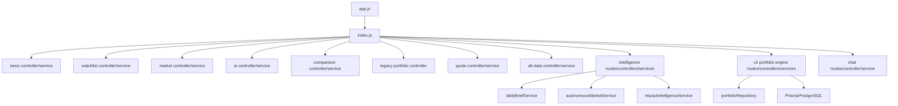
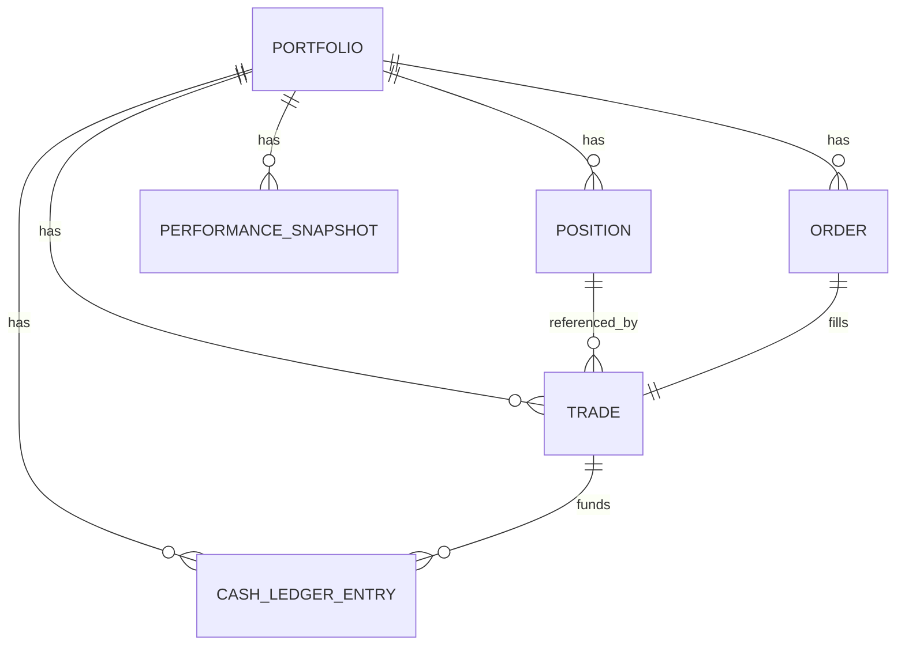
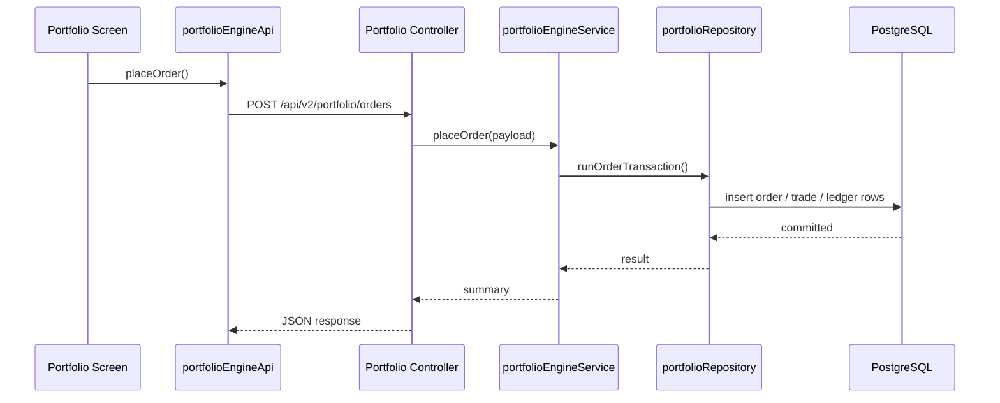
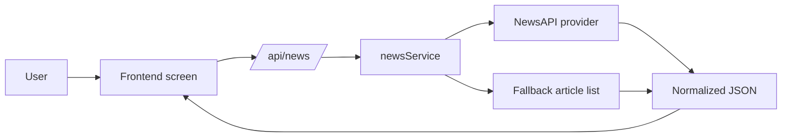
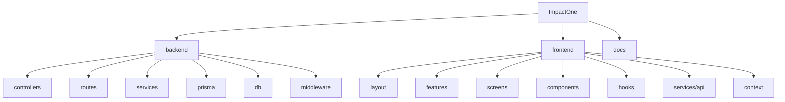
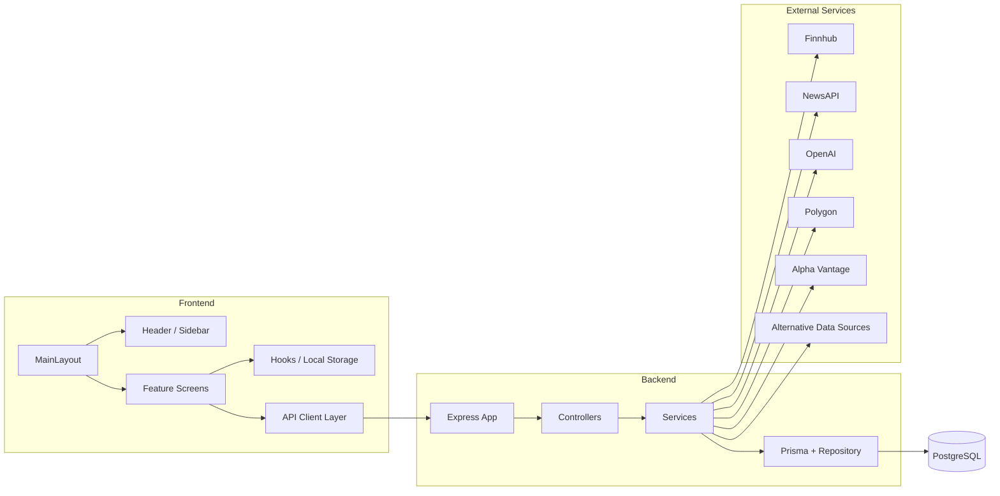

# ImpactOne Technical Architecture

**Status:** Current implementation snapshot  
**Scope:** Full MVP system architecture  
**Note:** This document describes the codebase as it exists today. Where a capability is not implemented, that gap is called out explicitly.
**Terminology:** Every domain concept named below (Recommendation, DecisionTrace, Committee Debate, Confidence, Conviction, and the rest) is defined exactly once in `CANONICAL_DOMAIN_MODEL.md`. Where this document names a field or model, that document states what it means and how it relates to every other document's usage of the same word.

---

## 1. System Overview

ImpactOne is a two-tier market intelligence platform with a React/Vite frontend and an Express backend. The product is organized around three major user experiences:

- Market intelligence and AI analysis
- Autonomous global intelligence and event propagation
- Paper-trading portfolio tracking

The backend aggregates live and fallback data from market, news, AI, and alternative-data providers. The frontend consumes those APIs through a shared client layer and renders a screen-based command-center interface.

At a high level, the system works like this:

1. The user opens the React app.
2. The frontend loads watchlist state from local storage and fetches intelligence from the backend.
3. The backend calls external providers such as Finnhub, NewsAPI, OpenAI, Polygon, Alpha Vantage, and alternative-data sources.
4. The backend normalizes the results into screen-friendly JSON payloads.
5. The frontend renders dashboards, analysis views, watchlists, and portfolio pages from those payloads.

There is no dedicated authentication layer yet. The system is effectively single-tenant and local-state-driven on the frontend, with portfolio persistence handled by PostgreSQL/Prisma on the backend.

---

## 2. Frontend Architecture

### 2.1 Frontend Stack

- React
- Vite
- React Router is installed, but the current UI uses a screen-switching shell rather than route-based navigation.
- Vitest and Testing Library for client-side tests

### 2.2 Application Shell

The frontend boots from [frontend/src/main.jsx](frontend/src/main.jsx) and renders:

- `AppProviders`
- `MainLayout`

`MainLayout` is the primary shell. It composes:

- `Sidebar`
- `Header`
- The active feature screen

### 2.3 Screen Model

The app is organized as a screen map rather than separate route pages. The current active view is stored in local component state and switched through the sidebar.

**Sprint 20 — onboarding gate.** `frontend/src/AppRoot.jsx` sits above `MainLayout` (rendered by `main.jsx` in place of it) and decides, based on `useInvestorProfile()`, whether to render a full-screen `OnboardingFlow` takeover (no sidebar/header chrome) or the normal app shell. The gate is shown once, the first time no `InvestorProfile` exists server-side.

Primary screens (Home is now the default landing view; Dashboard remains fully reachable, unchanged):

- Home
- Dashboard
- Global Intelligence
- AI Analysis
- Watchlist
- Portfolio
- Recommendations
- Daily Feed
- Themes
- Alerts
- My Profile
- Settings

### 2.4 Feature Layer

The `features/` directory acts as a thin adapter layer between `MainLayout` and screen components.

- `HomeFeature` -> Home screen (Sprint 20, default landing view)
- `DashboardFeature` -> dashboard home
- `AnalysisFeature` -> AI analysis screen
- `WatchlistFeature` -> watchlist screen
- `PortfolioFeature` -> portfolio screen
- `RecommendationsFeature` -> recommendations screen
- `NewsFeature` -> Daily Feed screen (renamed from Market News in Sprint 20)
- `ThemesFeature` -> Theme Dashboard screen (Sprint 20)
- `MyProfileFeature` -> investor profile screen (Sprint 20)
- `IntelligenceConsoleFeature` -> developer-only provider ops console (Sprint 23A), only registered in `screenMap` when `VITE_DEV_CONSOLE=true`
- `AlertsFeature` -> alerts screen
- `SettingsFeature` -> settings screen
- `GlobalIntelligenceFeature` is lazy-loaded for the heavier intelligence experience

### 2.5 Shared State and Hooks

Frontend state is intentionally lightweight:

- `useWatchlist` persists a normalized watchlist to `localStorage`
- `useVirtualPortfolio` powers the legacy simulated portfolio experience
- `usePortfolioEngine` powers the server-backed paper-trading engine and refreshes data on an interval

Watchlist synchronization uses custom browser events in addition to the storage event, which allows the header, dashboard, and watchlist screens to react immediately when the set changes.

### 2.6 Frontend API Layer

All frontend server calls flow through `frontend/src/services/api/`.

Client groups:

- `marketApi` -> quote and market data
- `analysisApi` -> AI analysis and comparisons
- `watchlistApi` -> watchlist intelligence
- `altDataApi` -> alternative-data summaries and sub-feeds
- `intelligenceApi` -> autonomous intelligence, briefs, feeds, and event analysis
- `committeeApi` -> investment committee analysis and track record
- `portfolioEngineApi` -> paper-trading portfolio engine

This keeps UI components from speaking directly to raw endpoints and gives the app a stable integration boundary.

### 2.7 Frontend Rendering Pattern

The screens use a few consistent patterns:

- Top hero section with page intent
- Card-based metrics and tables
- Conditional empty/loading/error states
- Local polling for changing intelligence data
- Custom visual treatments for charts, sparklines, and badges

### 2.8 Frontend Dependency Flow

```mermaid
flowchart TD
  Main[main.jsx] --> Root[AppRoot]
  Root --> Onboarding[OnboardingFlow]
  Root --> Layout[MainLayout]
  Layout --> Sidebar[Sidebar]
  Layout --> Header[Header]
  Layout --> Home[HomeFeature]
  Layout --> Dashboard[DashboardFeature]
  Layout --> Analysis[AnalysisFeature]
  Layout --> Watchlist[WatchlistFeature]
  Layout --> Portfolio[PortfolioFeature]
  Layout --> Recommendations[RecommendationsFeature]
  Layout --> News[NewsFeature]
  Layout --> Themes[ThemesFeature]
  Layout --> MyProfile[MyProfileFeature]
  Layout --> Alerts[AlertsFeature]
  Layout --> Settings[SettingsFeature]
  Layout --> Global[GlobalIntelligenceFeature]

  Dashboard --> WatchlistHook[useWatchlist]
  Dashboard --> VirtualPortfolio[useVirtualPortfolio]
  Dashboard --> Api1[watchlistApi]
  Dashboard --> Api2[altDataApi]
  Dashboard --> Api3[committeeApi]
  Dashboard --> Api4[intelligenceApi]

  Analysis --> Api5[marketApi]
  Analysis --> Api6[analysisApi]
  Analysis --> Api2
  Analysis --> Api4
  Analysis --> Api3

  Portfolio --> Api7[portfolioEngineApi]
  Portfolio --> PortfolioHook[usePortfolioEngine]

  Watchlist --> WatchlistHook
  Watchlist --> Api1
  Global --> Api4
  Home --> HomeApi[homeApi]
  News --> Api4
  Themes --> ThemeApi[themeApi]
  MyProfile --> InvestorProfileApi[investorProfileApi]
```

---

## 3. Backend Architecture

### 3.1 Backend Stack

- Node.js
- Express
- CORS and JSON body parsing
- Prisma ORM with PostgreSQL

### 3.2 Request Pipeline

The backend app is created in [backend/app.js](backend/app.js):

1. `cors()` is applied globally.
2. `express.json()` parses request bodies.
3. `/api` is mounted to the route tree.
4. `/health` provides a direct health check.
5. Shared error middleware converts uncaught errors to JSON.

### 3.3 Route Organization

The route tree is split by capability:

- [backend/routes/index.js](backend/routes/index.js) mounts the major feature groups
- [backend/routes/intelligenceRoutes.js](backend/routes/intelligenceRoutes.js) contains the autonomous intelligence endpoints
- [backend/routes/portfolioEngineRoutes.js](backend/routes/portfolioEngineRoutes.js) contains the server-owned paper portfolio engine
- [backend/routes/chatRoutes.js](backend/routes/chatRoutes.js) contains chat/question-answering endpoints

### 3.4 Controller Layer

Controllers are thin wrappers around services. Their responsibilities are:

- Parse query/body defaults
- Normalize user input
- Call service functions
- Return JSON responses
- Forward errors to the shared error handler

### 3.5 Service Layer

The service layer contains the actual domain logic. Major service groups include:

- Market and quote aggregation
- AI analysis
- Committee debate/explanation layer, folded into the Recommendation Engine's decision pipeline (Sprint 18A — see §6.5)
- Alternative-data fusion
- Autonomous market intelligence
- Daily brief generation and archive capture
- Paper-trading portfolio engine
- News fetching
- Chat / OpenAI synthesis

### 3.6 Error Handling

Unhandled backend errors flow into the shared middleware, which returns a JSON payload shaped like:

- `{ error: "message" }`

This keeps the API contract predictable even when services fail.

### 3.7 Backend Dependency Flow

---

## 4. Database Schema Overview

The backend uses Prisma with PostgreSQL for persisted trading data and daily brief snapshots.

### 4.1 Prisma Entry Point

- Prisma client is created through [backend/db/prismaClient.js](backend/db/prismaClient.js)
- `DATABASE_URL` is required for persistence features

### 4.2 Core Models

#### `Portfolio`

Represents the default paper portfolio.

Key fields:

- `id`
- `name`
- `cashBalance`
- `startingCapital`
- `benchmarkSymbol`
- timestamps

Relations:

- positions
- orders
- trades
- cash ledger entries
- performance snapshots

#### `Position`

Represents an open or closed paper position.

Key fields:

- `portfolioId`
- `symbol`
- `sector`
- `assetType`
- `quantity`
- `avgEntryPrice`
- `lastMarkPrice`
- `unrealizedPnl`
- `openedAt`
- `closedAt`

#### `Order`

Represents a buy or sell request.

Key fields:

- `symbol`
- `side`
- `quantity`
- `requestedPrice`
- `status`
- `rejectionReason`
- `createdAt`
- `filledAt`

#### `Trade`

Represents a filled order.

Key fields:

- `orderId`
- `portfolioId`
- `positionId`
- `symbol`
- `side`
- `quantity`
- `price`
- `realizedPnl`
- `executedAt`

#### `CashLedgerEntry`

Represents balance mutations tied to trades and resets.

Key fields:

- `type`
- `amount`
- `balanceAfter`
- `relatedTradeId`
- `description`
- `createdAt`

#### `PerformanceSnapshot`

Represents a point-in-time performance capture.

Key fields:

- `capturedAt`
- `totalValue`
- `cashBalance`
- `positionsValue`
- `realizedPnl`
- `unrealizedPnl`
- `totalReturnPct`
- `benchmarkReturnPct`

#### `DailyBriefSnapshot`

Represents the lightweight archive preview for daily briefs.

Key fields:

- `date` unique per day
- `sessionType`
- `executiveSummary`
- `confidenceScore`
- `topEvent`
- `capturedAt`
- `updatedAt`

This model supports the archive endpoint and is intentionally lightweight rather than a full replay store.

### 4.3 Schema View

---

## 5. Authentication Flow

Authentication is not implemented in the current backend.

Current state:

- No signup endpoint
- No login endpoint
- No session middleware
- No JWT or cookie-based auth layer
- No role or permission system

Implications:

- All API endpoints are effectively public
- User identity is not persisted at the platform layer yet
- The frontend uses local storage for watchlist preferences and local UI state only

Recommended future flow:

1. User signs up or logs in.
2. Backend issues a session or token.
3. Frontend stores only the session reference, not sensitive credentials.
4. Protected endpoints read the authenticated user from middleware.
5. Preferences, settings, watchlists, and billing data become user-scoped.

---

## 6. AI Engine Architecture

The AI layer is split into several cooperating services rather than one monolithic model call.

### 6.1 Core AI Functions

- `openaiService` provides ticker-level report generation with fallback behavior when the API key is missing or OpenAI fails.
- `impactIntelligenceService` orchestrates event analysis, impact scoring, historical similarity, propagation, and portfolio relevance.
- `investmentCommitteeService` runs a five-agent debate (bull/bear arguments, votes, confidence per persona) and a CIO synthesis narrative. **As of Sprint 18A it never publishes an independent decision** — it is a debate/explanation layer feeding the Recommendation Engine, not a second verdict engine (see §6.5).
- `committeeTrackRecordService` is a **frozen, legacy** read-only store (Sprint 18A) — historical committee decisions from before the canonical-verdict merge remain readable, but nothing writes new entries here anymore.
- `marketImpactService` converts market data into event-driven impact signals.
- `scenarioEngineService` builds structured scenario outputs.
- `propagationEngineService` and `relationshipGraphService` support cross-asset / cross-sector propagation logic.
- `historicalSimilarityService` supports analog-based event comparison.
- `portfolioIntelligenceService` converts holdings into portfolio exposure intelligence.

### 6.2 AI Design Pattern

The system prefers deterministic fallback outputs over hard failures. That means:

- If OpenAI is unavailable, the app still returns a usable analysis report.
- If some alternative-data providers are missing, the system still synthesizes a summary from remaining inputs.
- Responses are normalized into UI-friendly JSON rather than raw model text.

### 6.3 AI Request Flow

1. The frontend sends a ticker, event, or holdings payload.
2. The backend enriches the request with quote, news, and alternative data.
3. The AI service produces structured output.
4. Fallback logic fills gaps when live providers fail.
5. Results are cached in memory for short intervals where appropriate.

### 6.4 AI Caching

Several AI and intelligence services use in-memory caches to avoid repeated calls during rapid screen refreshes. This keeps the UX responsive but means the cache resets on server restart.

### 6.5 Canonical Decision Architecture (Sprint 18A)

An independent architecture review (`INTELLIGENCE_PLATFORM_REVIEW.md`) found that the Investment Committee and the Recommendation Engine independently computed two verdicts (`Strong Buy…Strong Sell` vs. `BUY/REDUCE/EXIT`) that could disagree in front of the same user on the same symbol. Sprint 18A corrects this with three new shared modules, all in `backend/services/`:

- **`canonicalVerdict.js`** — the one place the Committee's 6-way vote scale is reconciled against the Recommendation Engine's action vocabulary, and the one function (`buildCanonicalVerdictView`) that assembles what an API response exposes. It structurally strips any `action`/`decision`/`verdict`-shaped key from committee output before it can reach a response — a guard independent of, not just reliant on, `investmentCommitteeService.js`'s own discipline.
- **`scoringVocabulary.js`** — one documented contract (range/meaning/formula/fallback) for every score the platform computes: `confidence`, `conviction`, `quality`, `risk`, `relevance`, `sourceCredibility`, `evidenceFreshness`, `evidenceAgreement`, and a genuinely new `uncertainty` score. It wraps existing, already-tested scorers rather than duplicating them. Full detail: `API_CONTRACTS.md` §3.44.
- **`eventEnvelope.js`** — the canonical 19-field Event Envelope, frozen ahead of the Research Intelligence Engine build (`RESEARCH_INTELLIGENCE_ENGINE_DESIGN.md`) so multiple future engines integrate against one locked shape. `adaptLegacyFeedItemToEnvelope` proves the schema against the one real event source that exists today. Full detail: `API_CONTRACTS.md` §3.45.

**What changed structurally:** `investmentCommitteeService.js` no longer writes to `committeeTrackRecordService`'s JSON-file store and no longer returns an independent `cio.decision`. Its debate (arguments, expert votes, disagreement/consensus levels, synthesis narrative) is threaded into `autonomousRecommendationEngine.js`'s `evaluateSymbol()` — gated to symbols where an action already triggered, so it never runs across the full scan universe — and stored in both `Recommendation.explanation.committeeDebate` (for direct UI consumption) and the immutable `DecisionTrace.committeeDebate` (audit copy). `DecisionTrace` also gained `evidenceReferences` (canonical-envelope evidence, additive alongside the pre-existing `matchedEvents` shape) and `modelVersionMetadata`. `DecisionTrace` remains create-and-read-only — no update path was introduced.

### 6.6 Personalization (Sprint 20)

A new `InvestorProfile` model (`backend/services/investorProfileService.js`/`investorProfileRepository.js`) is a single-tenant singleton, following exactly the same `findFirst`/create convention `portfolioRepository.js` established for `Portfolio` — no `userId` field exists anywhere yet, a deliberate, named gap (see `VISION.md`'s Personalization Principles) rather than a real multi-tenant identity layer. It feeds three consumers, all additive to existing engines rather than new parallel systems:

- **`homeSummaryService.js`** — the Home screen's four-question aggregation. Reads a real, persisted `Recommendation` (when one exists) through `canonicalVerdict.buildCanonicalVerdictView` for "should I do anything today" — never a second, independently-computed verdict.
- **`feedPersonalizationService.js`** — layers age/risk-tolerance/investment-horizon-derived weighting on top of the existing relevance/recency/source-quality scoring (`autonomousMarketService.rankNewsArticles`), applied by `GET /api/intelligence/live-feed` only when a profile exists. Reorders only; never mutates an event's underlying facts.
- **`themeIntelligenceService.js`** — the Theme Dashboard's 7 pages, built on the existing `classifyEventType` classification (`autonomousMarketService.js`) rather than a new data source. `ThemeConfidenceSnapshot` (new model, mirrors `DailyBriefSnapshot`) accumulates real trend history via a new daily best-effort job (`themeSnapshotScheduler.js`, same single-instance `node-cron` convention as `schedulerService.js`).

### 6.7 World Memory (Sprint 21B)

A permanent, append-only historical layer (`backend/services/worldMemoryRepository.js`), designed to remain correct and queryable across years of accumulation rather than days. Distinct from every "snapshot" table before it (`ThemeConfidenceSnapshot`, `DailyBriefSnapshot`), which are overwritten/upserted per period: World Memory tables are never updated or deleted once written — where understanding of the past changes, a new row is added referencing the one it supersedes, and the old row is left exactly as it was.

Eight models, one spine and seven satellites, each answering one of nine standing questions by linking to an existing table rather than duplicating its content:

- **`WorldMemoryRecord`** (spine) — one row per real-world occurrence judged memory-worthy, distinct from `CanonicalEvent` (Sprint 21A, one row per deduplicated provider report of that occurrence); a record may anchor several `CanonicalEvent` rows. Answers *what happened* by linking to them.
- **`WorldMemoryCausalLink`** — *why did it happen*: an append-only causal edge list between records, accumulating real recorded reasoning over years rather than being recomputed from `relationshipGraphService.js`'s small hardcoded node set on every request.
- **`WorldMemoryStateChange`** — *what changed*: a dimension-agnostic before/after `Json` ledger row, so new kinds of tracked change never require a schema migration.
- **`WorldMemoryPrediction`** — *what prediction did we make*: a thin link into `Recommendation`/`DecisionTrace` plus a frozen action/confidence snapshot, so the prediction-as-stated stays queryable even as the live engine evolves.
- **`Outcome`** — *was it correct*: implements `OUTCOME_INTELLIGENCE_ENGINE.md`'s (Sprint 19, previously design-only) grading schema exactly, wired into World Memory via `worldMemoryPredictionId`. No grading algorithm exists yet — this sprint added the table only, so a future grading engine has somewhere real to write.
- **`WorldMemoryThesisRevision`** — *which thesis changed*: the first place theme thesis **text** history (not just `ThemeConfidenceSnapshot`'s confidence number) is persisted. `revisionNumber` is assigned by the repository itself inside a retry-on-conflict loop, never by the caller, so concurrent writers can't collide or skip a number.
- **`WorldMemorySectorImpact`** — *which sectors benefited/were hurt*: one row per sector per record, since a single event routinely helps some sectors while hurting others simultaneously.
- **`WorldMemoryLesson`** — *what did we learn*: never edited or deleted; a revised understanding is a new row with `supersedesId` pointing at the old one, which stays exactly as originally written.

`worldMemoryRepository.js` enforces this at the API-surface level, not just by convention: every function is a `.create()`, and the file contains no `.update()`/`.delete()`/`.upsert()` call anywhere — verified by a source-scanning test (`worldMemoryRepository.immutability.test.js`) that strips comments before checking, so the guarantee can't be faked by a doc comment. This sprint is schema and persistence only — no grading logic, no new routes, no scheduler, no UI.

---

## 7. Portfolio Engine

The current portfolio engine is server-owned and backed by PostgreSQL.

### 7.1 Engine Responsibilities

- Create or load the default paper portfolio
- Place buy and sell orders
- Update positions and cash balances in a transaction
- Log trades and ledger entries
- Capture performance snapshots
- Reset the portfolio state

### 7.2 Transaction Model

The write path is intentionally transactional:

- Orders are created inside a Prisma transaction
- Cash balance checks are performed against locked portfolio state
- Positions and ledger entries are updated atomically
- This reduces the risk of race conditions when multiple orders are placed quickly

### 7.3 Portfolio Data Flow

### 7.4 Current Limitations

- Only one default portfolio exists today
- No multi-user or account-scoped portfolios
- No broker integration
- No short-selling or leverage
- Benchmark-relative return is present as a field but not fully wired for real benchmark tracking

---

## 8. News Ingestion Pipeline

### 8.1 Current Flow

The current news path is intentionally simple:

1. Frontend requests `/api/news`.
2. Backend calls `newsService.getNews(query)`.
3. If `NEWS_API_KEY` is configured, NewsAPI is queried.
4. If the key is missing or the provider fails, the service returns a fallback story list.
5. The frontend renders the news payload or a static placeholder surface.

### 8.2 Ingestion Characteristics

- Query-driven rather than a broad crawler
- English-language only in the current implementation
- Small result set with fixed page size
- No news persistence layer today

### 8.3 Pipeline Summary

---

## 9. Market Data Providers

The system currently uses multiple external sources, each with a distinct role.

### 9.1 Finnhub

Primary market quote and company-profile provider.

Used for:

- Live quote data
- Company profile
- Recommendation trends
- Some market enrichment for the portfolio engine

### 9.2 NewsAPI

Used for:

- Market news retrieval

### 9.3 OpenAI

Used for:

- AI ticker analysis
- Daily brief generation
- Chat question answering

### 9.4 Polygon

Present in the service layer as a market data dependency for broader price/market access.

### 9.5 Alpha Vantage

Used as an additional market/macro data source.

### 9.6 Alternative Data Sources

The alternative-data layer combines multiple non-price signals, including:

- Macro regime data
- SEC filing signals
- Congressional trading signals
- Prediction-market style signals
- COT-style positioning signals

The backend also contains services for alternative fusion and derived signals rather than exposing each provider directly to the frontend.

### 9.7 Provider Strategy

Provider behavior is designed around graceful degradation:

- Live data when available
- Fallback data when keys or providers are unavailable
- Synthetic summaries if only some inputs are present

---

## 10. Background Jobs

Three single-instance, in-process `node-cron` schedulers exist today (`schedulerService.js` for the autonomous recommendation engine, gated by `AUTONOMOUS_ENGINE_ENABLED`; `themeSnapshotScheduler.js`, daily; `providerScheduler.js`, Sprint 21A, every 15 minutes). All three share one shape (`start/stop/getStatus/runNow`) and are bootstrapped only from `server.js`, never `app.js`, so tests requiring `app.js` never leak a running timer.

### 10.1 What Exists Today

- Three `node-cron` schedulers (above)
- Frontend polling every 60 seconds on certain screens
- In-memory cache refreshes on demand
- Best-effort daily brief snapshot capture during brief generation
- Portfolio performance snapshot capture on demand
- Best-effort daily theme confidence snapshot capture (Sprint 20)
- Provider ingestion runs with rate limiting and retry (Sprint 21A — see §10.4)

### 10.2 What Does Not Exist Yet

- Queue workers (Redis/BullMQ or equivalent)
- Distributed/multi-process execution
- Event-driven background consumers
- Scheduled ETL pipelines beyond the three schedulers above

### 10.3 Practical Impact

Background behavior is now a mix of three lightweight in-process schedulers plus user-triggered/screen-poll-driven work. This is still a single-process job model — there is no durable, multi-worker job orchestration layer, and none is planned until real scale requires it (see §10.4's queue note).

### 10.4 Provider Framework (Sprint 21A)

Distinct from §9's market-data providers (Finnhub, NewsAPI, OpenAI, Polygon, Alpha Vantage — used synchronously inside request handling), the provider framework is a background ingestion layer: `backend/services/providers/` defines 15 source providers (Reuters/Bloomberg wire, SEC, Reddit, X, Telegram, Polymarket, Fed, ECB, FOMC, FDA, NASA, US Treasury, Congress, Major Earnings, Patent Feeds), each built via `providerFactory.createProvider()` against one shared interface (`baseProviderContract.js`). `providerIngestionService.runProviderIngestion(providerId)` rate-limits, retries (`retryPolicy.js`), maps results through the canonical event envelope (`eventEnvelope.js`), and persists them with DB-level dedup (`canonicalEventRepository.js`, unique on `deduplicationKey`) — writing one `ProviderRunLog` row per run, exposed via `providerHealthService.js` and `GET /api/v2/providers`. `providerScheduler.js` runs every registered provider sequentially every 15 minutes.

Only the wire-news provider has a real `fetchImpl` today (delegates to the existing `autonomousMarketService` news pipeline); the other 14 honestly return `[]` — no live integration yet, and no fabricated placeholder data. `runProviderIngestion(providerId)` is deliberately a discrete, stateless, idempotent unit of work — the explicit swap point for a future per-provider queue, which does not exist yet (no queue library has been added).

This layer performs ingestion only. Nothing in `backend/services/providers/` or `providerIngestionService.js` calls `autonomousRecommendationEngine`, `canonicalVerdict`, or any theme/recommendation write path.

**Sprint 23A** extended ops visibility with three more read endpoints alongside Health: `providerMetricsService.js` (full-history aggregation — totals, dedup rate, error rate, avg duration — distinct from Health's last-10-runs status), `providerDiagnosticsService.js` (live contract re-check via the registry's own `validateProviderShape`, current rate-limiter budget via a new `rateLimiter.getState()`, and the most recent error), and a metadata route (the static registry entry). `rateLimiter.getState()` is read-only and reads the exact limiter instance `providerIngestionService` runs against (via a new exported `getLimiterFor`), never a fresh simulation. Sprint 23A also added the framework's first frontend surface — a developer-only **Intelligence Console** (`frontend/src/screens/IntelligenceConsoleScreen.jsx`) consuming all four ops endpoints plus the manual run trigger, gated behind `VITE_DEV_CONSOLE=true` (same feature-flag precedent as §7's `VITE_PORTFOLIO_ENGINE`) — absent from `screenMap`/`navItems` and therefore unreachable in any normal build. Constraint compliance (no coupling to `autonomousRecommendationEngine`, `canonicalVerdict`, `portfolioEngineService`, or `worldMemoryRepository`) was verified by grep after implementation, not merely asserted — see `PROJECT_STATUS.md` §29.

---

## 11. Deployment Architecture

### 11.1 Current Runtime Shape

The project is designed to run locally or as two cooperating services:

- Frontend dev server via Vite
- Backend API server via Node/Express

### 11.2 Startup Scripts

Repository scripts indicate the intended runtime:

- `npm run server` -> backend server
- `npm run client` -> frontend dev server
- `npm run dev` -> both together
- `npm run build` -> frontend production build

### 11.3 Environment Configuration

The backend loads environment values from multiple candidate `.env` locations, including repo root, backend, and frontend paths. Key variables include:

- `PORT`
- `NODE_ENV`
- `OPENAI_API_KEY`
- `FINNHUB_API_KEY`
- `POLYGON_API_KEY`
- `NEWS_API_KEY`
- `ALPHA_VANTAGE_API_KEY`
- `DATABASE_URL`
- `DATABASE_URL_TEST`

### 11.4 Current Deployment Assumptions

- Stateless API server aside from Prisma/Postgres persistence
- Frontend is a static SPA after build
- Secrets are environment-variable driven
- No container orchestration config is currently present in the repository snapshot

### 11.5 Recommended Target Deployment

For production scaling, the likely target shape is:

- Static frontend hosted on a CDN or static platform
- Backend API hosted on a Node runtime service
- PostgreSQL managed externally
- Secrets injected through deployment environment settings

---

## 12. Folder Structure

### 12.1 Repository Root

- `backend/` -> API server, Prisma schema, services, tests
- `frontend/` -> React/Vite app
- `docs/` -> supporting product and architecture docs

### 12.2 Backend Structure

- `backend/app.js` -> Express app composition
- `backend/server.js` -> process entrypoint
- `backend/config/` -> environment loader
- `backend/controllers/` -> request handlers
- `backend/routes/` -> route registration
- `backend/services/` -> business logic and provider integration
- `backend/db/` -> Prisma client setup
- `backend/prisma/` -> schema and migrations
- `backend/middleware/` -> shared error middleware
- `backend/test/` -> test helpers and integration setup

### 12.3 Frontend Structure

- `frontend/src/main.jsx` -> app bootstrap
- `frontend/src/layout/` -> shell and navigation
- `frontend/src/features/` -> screen adapters
- `frontend/src/screens/` -> main page implementations
- `frontend/src/components/` -> reusable UI pieces
- `frontend/src/hooks/` -> stateful client logic
- `frontend/src/services/api/` -> backend API clients
- `frontend/src/context/` -> app providers
- `frontend/src/utils/` -> support utilities

### 12.4 Folder Tree View

---

## 13. Dependency Graph

### 13.1 High-Level Graph

### 13.2 Dependency Notes

- The frontend does not call external providers directly.
- The backend is the only layer that knows provider credentials.
- Prisma is only used in the backend portfolio and archive persistence paths.
- Most intelligence services are read-heavy and fall back gracefully when providers fail.

---

## 14. Future Scaling Strategy

### 14.1 Authentication and Multi-Tenancy

Add a real auth layer first, then scope all persisted entities by user ID. This is the biggest structural gap for product maturity.

### 14.2 Durable Background Processing

Introduce a worker/queue system for:

- Brief generation
- News ingestion
- Provider retries
- Scheduled snapshots
- Intelligence refreshes

### 14.3 Caching and Performance

Move beyond in-memory caching to shared cache infrastructure so multiple backend instances can reuse intelligence results.

### 14.4 Data Ingestion Expansion

Split provider ingestion into dedicated adapters and normalize their outputs into a stable internal schema. That will make it easier to add new sources without changing UI contracts.

### 14.5 Analytics and Historical Depth

Persist richer historical intelligence data so the app can support:

- Full archive browsing
- Trend analysis
- Model calibration
- Backtesting of event impact

### 14.6 Horizontal Scaling

The current backend is close to stateless aside from PostgreSQL and in-memory caches. With auth and shared caching added, the API could scale horizontally behind a load balancer.

### 14.7 Frontend Evolution

The current screen shell can evolve into route-based navigation without changing the backend contract layer. That would help with deep-linking, session persistence, and shareable pages.

---

## 15. Summary

ImpactOne currently has a clear split between:

- A React/Vite command-center frontend
- An Express/Prisma intelligence backend
- Provider-driven market, news, and AI synthesis services
- A transactional paper-trading engine

The system is already strong in read-heavy intelligence generation. The main architecture gaps are auth, durable background jobs, and multi-user data scoping. Those are the natural next steps once the MVP stabilizes.
