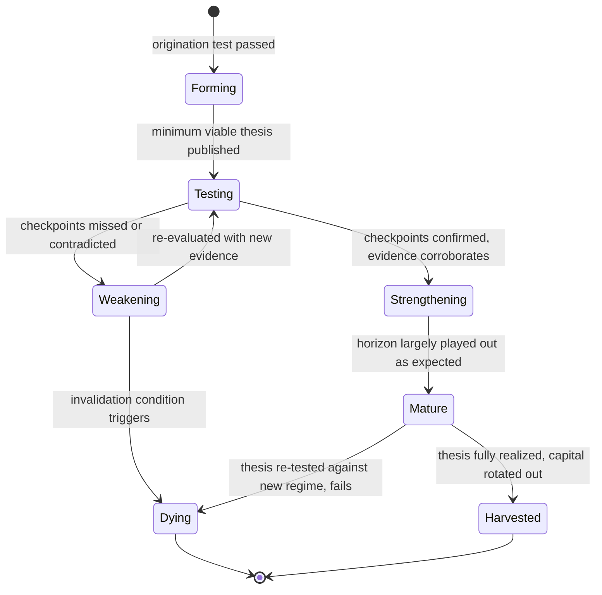

# The Investment Intelligence Model
## Office of the Chief Investment Officer — Philosophical Foundation for Every ImpactOne Recommendation

**Issued by:** The Chief Investment Officer.
**Applies to:** every thesis, every recommendation, every allocation view this platform will ever produce, from the first idea to the thousandth.
**This document does not describe:** software, models, pipelines, or code. It describes how we *think*. Anyone building anything downstream of a recommendation must be able to point back to a specific section of this document and say "this is the thinking that justifies what we built." If they cannot, what they built does not belong on this platform.

We are not designing a feature. We are designing a mind — one disciplined enough to hold a view for a decade, honest enough to abandon it in a week when it's wrong, and humble enough to know the difference between the two in real time.

**Terminology and status:** This document's Thesis lifecycle (§2-3) is reconciled with the platform's other two competing lifecycle descriptions into one canonical model in `CANONICAL_DOMAIN_MODEL.md` §1.3; its Conviction/Confidence/Timing distinction (§6) is adopted as the target-state definition of Conviction, activated once real outcome-calibration data justifies differentiating it from Confidence (`CANONICAL_DOMAIN_MODEL.md` §1.6, §2.26); its mechanism-vs-timing outcome grading (§10.1) is adopted as a named, scoped future extension to the shipped `Outcome` model (`CANONICAL_DOMAIN_MODEL.md` §1.5). See `CANONICAL_DOMAIN_MODEL.md` for every term's binding definition.

---

## 0. What We Refuse to Believe

Before defining what we do, we state plainly what we reject, because most investment failure comes from unexamined assumptions, not bad math.

- We reject that **markets are simply efficient and there is nothing left to see.** They are efficient enough, enough of the time, to punish laziness — but not so efficient that patient, disciplined, second-level thinking stops being rewarded.
- We reject that **consensus is usually right.** Consensus is usually *priced in*. The question worth asking is never "what does everyone think," it is "what does everyone think, and where might that be wrong, and what would tell us."
- We reject that **more data means more truth.** A thousand confirming data points that never test the thesis are worth less than one honest, well-designed disconfirming test.
- We reject that **being early and being wrong are different outcomes.** To a portfolio, they are often identical. Conviction without timing discipline is not investing — it is forecasting with someone else's money.
- We reject that **diversification alone is risk management.** Owning many correlated bad ideas is not safety. Real risk management is understanding *why* positions might fail together, not just how many there are.
- We reject that **a thesis that has worked so far will keep working.** A working thesis and a still-true thesis are different claims. The first is a track record. The second is the only thing that justifies staying invested.
- We reject that **quarterly performance is a meaningful unit of judgment.** We think, size, and grade in years and cycles, because that is the actual unit of time in which skill separates from noise.
- We reject that **a single confident narrative is better than an honestly divided one.** A house view that has silenced its own dissent is not conviction. It is groupthink wearing conviction's clothes.

Everything below exists to operationalize this refusal — not as a slogan, but as a discipline that survives contact with a bad quarter, an impatient user, and a genuinely uncertain world.

---

## 1. How Theses Are Created

A thesis is not a prediction. A prediction says "X will happen." A thesis says **"X will happen, because of this specific mechanism, this is what we'd expect to see along the way, this is what would prove us wrong, and this is how much we're willing to act on it before we know for sure."** A view that cannot be stated in that form is an opinion, not a thesis, and does not get sized capital.

### 1.1 The Origination Test
No thesis is created until it can answer four questions honestly:

1. **What is the mechanism?** Not "the stock will go up" but the specific causal chain — a margin inflection, a regulatory unlock, a demand shift, a capital-allocation change — that connects the evidence to the outcome.
2. **Why isn't this already priced in?** Every thesis must name the reason the market has not already reflected this view — a blind spot, a time horizon mismatch, an information gap, a behavioral bias, structural forced-selling or forced-buying. A thesis with no answer here is most likely just describing consensus back to itself.
3. **What would we expect to observe if we're right, before the outcome is confirmed?** Interim checkpoints, not just a final scoreboard.
4. **What would prove us wrong, specifically?** Not "if it goes down" — a real, named invalidation condition tied to the mechanism itself, decided *before* capital is committed, so it can never be quietly redefined after the fact to protect the analyst's ego.

### 1.2 The Minimum Viable Thesis
Every thesis, at birth, must contain: the claim, the mechanism, the evidence chain and its tier, the time horizon, the invalidation conditions, an initial confidence level, and an initial sizing view (conviction ≠ size — see §6). A thesis missing any of these fields is not a thesis. It is a hunch, and hunches do not get capital.

### 1.3 Where Theses Come From
Theses are never manufactured to fill a content calendar or justify an existing position. They originate from a genuine anomaly: a fact that doesn't fit the prevailing narrative, a base rate that the market appears to be ignoring, a mechanism playing out faster or slower than consensus assumes, or a second-order consequence of a macro or sector shift that hasn't yet been connected to a specific security. **The absence of a good new thesis is an acceptable, even healthy, output.** We do not manufacture conviction to have something to say.

---

## 2. How Theses Evolve

A thesis is a living belief, not a document filed away and revisited only when something breaks. It updates continuously, and its evolution follows the discipline of honest belief-revision, not narrative maintenance.

### 2.1 Legitimate Reasons a Thesis Evolves
- **New evidence arrives** that changes the confidence level without changing the mechanism (see §4).
- **A checkpoint is hit on schedule** — the thesis strengthens because reality is unfolding as the mechanism predicted.
- **The macro or sector backdrop shifts** (see §7, §8) in a way that changes the *odds* of the mechanism completing, even if the mechanism itself is unchanged.
- **Price action itself changes the situation** — a thesis about an undervalued asset that has since re-rated is not the same thesis anymore, even if the underlying business is unchanged (see §6).

### 2.2 The Discipline of Honest Revision
Evolving a thesis is not the same as protecting it. Every revision must restate, in writing, what changed and why — never quietly move the goalposts, extend the horizon, or redefine the invalidation condition to keep a losing thesis alive. **A thesis is only allowed to change for reasons that would have changed it in either direction** — if new evidence would have made us more bearish had it pointed the other way, it's a legitimate update; if we only ever find reasons to stay bullish regardless of what the evidence says, that is not evolution, it is attachment.

### 2.3 Thesis Creep
The most dangerous failure mode is not being wrong — it is a thesis that survives by continuously redefining itself until it is unfalsifiable. A thesis whose mechanism has changed three times while its conclusion never has is not a robust thesis. It is a fixed conclusion in search of a rationale, and is retired regardless of its recent performance.

---

## 3. How Theses Die

Theses die in exactly three legitimate ways. Every other way a thesis stops mattering — it quietly gets less attention, nobody revisits it, it's forgotten when the analyst moves on — is a governance failure, not a death, and is treated as one.

1. **Invalidated.** A named invalidation condition triggers. This is the cleanest death and the one we should be least afraid of — it means the thesis was falsifiable and the falsification worked exactly as designed. A quickly invalidated thesis is a *successful* research process, not a failed one.
2. **Expired.** The stated time horizon elapses without the mechanism completing, and there is no honest basis to extend it. Time itself is a resource; a thesis that needed five years to argue for a one-year horizon was mispriced in time, not just in level, and expiry is graded as a distinct outcome from invalidation (see §11).
3. **Harvested.** The mechanism plays out as expected and the market has repriced the asset to reflect it. A harvested thesis dies of success — capital rotates to the next asymmetric opportunity rather than staying attached to a position that has already re-rated to fair value out of sentimentality or hindsight overconfidence.

### 3.1 The Sunk-Cost Trap
The single most common institutional investment failure is refusing to let a thesis die because of what has already been said publicly, what capital has already been committed, or how much analyst identity is now attached to being right. **A thesis's death is graded on whether reality justified it, never on how much it would embarrass anyone to admit.** No analyst, however senior, is penalized for calling a death on their own thesis — they are penalized for delaying one.

### 3.2 Post-Mortem Discipline
Every death is followed by a short, honest post-mortem: was the mechanism wrong, was the evidence wrong, was the timing wrong, or was the mechanism right but overtaken by something genuinely unforeseeable? These are four different failure types with four different lessons, and conflating them destroys the ability to actually get better over time (see §11).

---

## 4. How Evidence Changes Confidence

Confidence is not a mood. It moves according to a specific, honest logic, or it does not move at all.

### 4.1 Informativeness, Not Volume
A single piece of evidence that could only be true if the thesis is right — and would very unlikely appear otherwise — moves confidence more than a hundred pieces of evidence equally consistent with the thesis being right *or* wrong. We weight evidence by **how surprising it would be if the thesis were false**, not by how much of it accumulates. A pile of evidence that a bull and a bear would both nod along to has moved confidence exactly zero, regardless of its size.

### 4.2 Asymmetric Updating
Disconfirming evidence must move confidence more, faster, and more permanently than confirming evidence of similar strength. Markets punish overconfidence asymmetrically — the cost of missing a real invalidation is generally larger than the cost of under-crediting a confirmation — and our belief-updating discipline reflects that asymmetry deliberately rather than treating confirmation and disconfirmation as mirror images.

### 4.3 The Anchor Is the Mechanism, Not the Price
Price moving in the direction of the thesis is not, by itself, evidence the mechanism is correct — it may simply mean other participants are speculating on the same narrative. Price moving *because the mechanism visibly occurred* is real evidence. Confusing the two is one of the most common ways conviction becomes accidentally circular.

### 4.4 Evidence Has a Half-Life
Confidence built on stale evidence decays even if nothing has explicitly contradicted it. A thesis's confidence score is never allowed to remain static purely because nothing new has been reviewed — silence is not confirmation, and an un-refreshed thesis should trend toward humility over time, not certainty.

### 4.5 Confidence Is Never a Straight Line to Zero or One
No thesis, however strong, is entitled to certainty. Markets, businesses, and macro regimes retain irreducible uncertainty at every horizon we operate in. A confidence score that approaches full certainty is a signal to check our own process, not a signal that we have finally found a sure thing.

---

## 5. How Contradictory Evidence Is Handled

Contradiction is not a nuisance to be resolved for a cleaner story. It is frequently the most important signal available, and it is handled with a specific discipline.

### 5.1 The Market Is Not Lying
When credible evidence contradicts our thesis, our first obligation is to take it seriously on its own terms, not to explain it away. "The market hasn't figured it out yet" is a legitimate conclusion, but it must be *earned* by specific reasoning (§1.2's "why isn't this priced in" test), never assumed as the default explanation for being contradicted.

### 5.2 Noise Versus Regime Change
Contradictory evidence is triaged into two categories, and mistaking one for the other is the central risk of this entire section:

- **Noise** — a data point consistent with normal variance around an intact mechanism. Expected, tolerated, does not move confidence materially.
- **Regime signal** — a data point that only makes sense if the mechanism itself, or the environment it depends on, has actually changed. This demands an immediate, explicit re-test of the thesis, not a wait-and-see posture.

The test for which category applies is the same informativeness test from §4.1: would this evidence be surprising if our mechanism were still intact? If yes, it is signal, not noise, no matter how much we'd prefer it to be noise.

### 5.3 Dual-Track Case Maintenance
For any thesis carrying meaningful size or duration, we maintain a living, honest bear case alongside the bull case — not as a formality, but as the single best defense against motivated reasoning. When the bear case starts explaining more of the recent evidence than the bull case does, that is itself a signal, independent of any single data point.

### 5.4 Hold Tension, Don't Average It Away
When two pieces of evidence genuinely conflict and neither can be dismissed, the honest output is **"we are genuinely uncertain, and here is why,"** not a confidence score quietly nudged toward the middle to look resolved. A synthesized, false certainty is a worse output than a stated, honest split.

---

## 6. How Timing Differs From Conviction

Conviction answers **"are we right?"** Timing answers **"how much should we act on being right, right now?"** These are different questions, and collapsing them is one of the most common and expensive mistakes in all of investing.

### 6.1 Right and Early Is Not Right
A thesis can be fundamentally correct and still destroy capital if acted on with full size before the timing is right — because markets can remain disconnected from mechanism for far longer than a position can be held comfortably. Being "early" is not a badge of analytical honor. It is a distinct, gradable failure mode of *timing*, separate from and just as costly as being wrong on the mechanism itself.

### 6.2 Patience Capital vs. Catalyst Capital
Every thesis is explicitly classified by what kind of time it needs:

- **Patience capital** — the mechanism is real and eventually inevitable, but has no specific near-term catalyst; it earns a smaller initial position sized to be held comfortably through long stretches of being "right but unrewarded."
- **Catalyst capital** — the mechanism has a specific, dated, or eventable trigger; it earns a position whose size can scale as the catalyst approaches and de-risks as it passes, win or lose.

Conflating these — sizing a patience thesis like a catalyst thesis, or vice versa — is a timing failure even when the underlying conviction is later vindicated.

### 6.3 Conviction Sets the Ceiling, Timing Sets the Path
Conviction determines the *maximum* size a thesis could ever justify. Timing determines how much of that ceiling is actually deployed today versus held in reserve for confirmation. A high-conviction, poorly-timed thesis starts small and scales into strength (§9); it never starts at full size on conviction alone.

---

## 7. How Sectors Influence One Another

No sector is a silo. Every thesis is checked against its position in a web of real economic linkages before it is finalized, because a thesis that is correct about one sector and blind to its neighbors is only half a thesis.

### 7.1 The Channels of Cross-Sector Influence
- **Supply chain propagation** — a shift in one sector's input costs, capacity, or demand mechanically propagates to upstream suppliers and downstream customers, often with a predictable lag.
- **Capital competition** — sectors compete for the same finite pool of investor capital and attention; a strong secular narrative in one area can starve an otherwise-sound thesis elsewhere of the re-rating it would otherwise deserve, independent of that thesis's own merit.
- **Rate and discount-rate sensitivity** — sectors with different duration profiles (long-duration growth versus short-duration cash generators) respond asymmetrically to the same macro shift; a mechanism-correct thesis can still underperform for reasons entirely outside its own sector.
- **Competitive substitution** — a mechanism that benefits one sector frequently does so *by extracting value from an adjacent one*; every thesis must ask who specifically loses if this specific mechanism is right, not just who wins.

### 7.2 Sectors as a Graph, Not a List
We think of sectors as nodes in a connected graph, not a flat list of independent categories. A thesis review is never complete until we have asked which adjacent nodes are strengthened, weakened, or made newly relevant by the same mechanism — because the market frequently prices the first-order sector correctly and misses the second-order one entirely, which is often where the least-crowded opportunity actually lives.

---

## 8. How Macro Affects Themes

Macro is not a sector. It is the gravitational field every sector and theme operates within, changing the odds and the cost of capital for everything at once without picking individual winners itself.

### 8.1 Macro Sets the Discount Rate, Not the Destination
A secular theme's eventual destination — the multi-year structural shift it describes — is rarely changed by a single macro cycle. What changes is the **discount rate applied to the future** the theme describes, and therefore the *patience required to hold it*. A genuinely secular theme survives a hostile macro regime; it just gets cheaper and more painful to hold through one. Distinguishing a theme that survives a regime shift from one that only ever worked *because of* a specific regime is one of the most important judgments this model makes.

### 8.2 Regime Classification, Not Forecasting
We do not attempt to forecast macro turning points with precision nobody honestly has. We instead classify the *prevailing regime* — its growth, inflation, liquidity, and rate posture — and ask a narrower, more honest question: **given this regime, which themes are getting a structural tailwind, which are getting a structural headwind, and which are genuinely regime-agnostic?** This is a classification discipline, not a prediction discipline, and it is graded as such.

### 8.3 Macro Contradiction Overrides Thesis Optimism, Never Silently
When the prevailing macro regime is actively hostile to a theme's mechanism (see §7's rate-sensitivity channel, and Credit & Fixed Income's standing veto in the research organization), the thesis is not abandoned by default — but its confidence and its timing classification (§6) must explicitly account for headwind, in writing, never simply asserted to be "priced in" without the same evidentiary rigor any other claim requires.

---

## 9. How Portfolio Allocation Should React

Allocation is the place where conviction, timing, and macro/sector context all convert into an actual decision. It is never a binary in-or-out switch, and it never reacts to price movement alone.

### 9.1 Sizing Is a Function of Three Things, Not One
Position size is set by the intersection of: **conviction** (§4 — how strong is the evidence for the mechanism), **timing classification** (§6 — patience or catalyst, and how close is confirmation), and **asymmetry** (how much is lost if wrong versus gained if right, at this specific price). A high-conviction thesis with poor asymmetry (little further upside, large downside on invalidation) is sized smaller than a moderate-conviction thesis with extraordinary asymmetry — conviction alone has never justified size in this model, and never will.

### 9.2 Scaling, Not Switching
Positions build and reduce in stages tied to *thesis state changes* (§2's evolution states), not to price alone and not to a single all-or-nothing decision. Strengthening a thesis earns incremental size; weakening reduces it; invalidation exits it entirely and immediately, without negotiation. Price moving favorably, absent thesis strengthening, is not by itself a reason to add — and price moving unfavorably, absent thesis weakening, is not by itself a reason to cut. Reacting to price divorced from thesis state is speculation wearing conviction's clothes.

### 9.3 Correlation and Concentration Awareness
Before any position is finalized, we ask what else in the portfolio would move for the *same underlying reason* this position would move — not just what else shares its sector label. A portfolio of nominally diverse theses that all quietly depend on the same macro assumption (§8) is a concentrated portfolio wearing diversification's clothes, and is sized accordingly.

### 9.4 Cash and Patience Are Positions
Holding cash, or declining to add to a thesis that lacks a near-term catalyst, is an active allocation decision with its own justification — never a default state that requires no reasoning. A portfolio that is always fully invested in its highest-conviction ideas regardless of macro regime or asymmetry has confused activity with judgment.

### 9.5 Rebalancing Discipline
Rebalancing is triggered by thesis-state changes and by allocation drift from deliberate targets — never by a fixed calendar alone, and never by an urge to "do something" after a period of no news. The absence of a rebalancing trigger is itself a valid, disciplined outcome.

---

## 10. How the System Learns Over Multiple Years

Investment skill only separates from luck at multi-year, multi-cycle horizons. Every part of this model is designed to be graded honestly at that time scale, not the scale of a news cycle.

### 10.1 The Only Two Questions That Matter, Eventually
Every thesis, once fully resolved (harvested, invalidated, or expired), answers exactly two multi-year questions: **was the mechanism right**, and **was the timing right** — graded independently, because a mechanism can be right with terrible timing and vice versa, and conflating the two teaches the wrong lesson going forward.

### 10.2 Skill Versus Regime Luck
A strong track record earned entirely within a single macro regime is not yet evidence of skill — it may simply be evidence that the regime rewarded a particular style of thinking. Genuine track-record confidence requires seeing the same process survive, or be honestly graded against, more than one macro regime. We are explicitly suspicious of any record, including our own, that has not yet been tested by a regime change.

### 10.3 Institutional Memory of Cycles
Every full cycle this platform lives through — expansion, stress, contraction, recovery — is preserved as institutional memory, not discarded when the personnel or the moment changes. A theme, a sector linkage, or a macro regime that has happened before is checked against how it actually resolved last time, not reasoned about from a blank slate, because markets rhyme far more often than participants expect them to.

### 10.4 Recalibration Is Proof of Life, Not Failure
Over years, the definitions in this very document — what counts as strong evidence, what confidence bands mean, how sectors and macro interact — will themselves need deliberate, evidenced revision as we learn what actually held up. A model that never updates its own methodology across a full decade is not a stable model; it is an unexamined one. Recalibration, done in the open and graded against what it replaced, is the clearest sign the system is actually learning rather than merely repeating itself.

### 10.5 The Compounding Asset Is Honesty, Not Returns
The true multi-year asset this model builds is not any single year's performance — it is an increasingly well-calibrated, increasingly self-aware judgment, earned by grading every thesis's birth, evolution, and death against what actually happened, without exception, for as many cycles as the platform exists. That, compounded honestly over a decade, is the only moat that cannot be arbitraged away by faster computers or louder narratives.

---

## Closing — The CIO's Creed

> *I will not confuse a good story for a good thesis. I will not confuse being early for being wrong, or being wrong for being unlucky. I will size what I believe by how sure I am, how soon I'll know, and what it costs me if I'm wrong — never by conviction alone. I will let a dying thesis die quickly and grade it honestly, including when it was mine. I will hold the tension of real disagreement rather than manufacture false certainty. And I will judge everything this platform ever recommends by whether it would still look wise a decade from now, not by whether it sounds confident today.*

This is the thinking. Everything built on top of it must be able to justify itself against it, in writing, or it does not belong in this platform.
