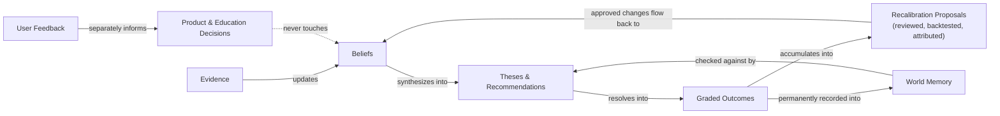

# Learning System Blueprint
## Office of the Chief Learning Officer — ImpactOne

**Mandate:** Design how user feedback, graded outcomes, evidence, and World Memory should make this platform genuinely smarter over years — not busier, not more confident-sounding, but more *calibrated*. This document does not design any model, pipeline, or code. It designs the discipline that governs how any of those things are allowed to change over time.

---

## Four Inputs, Four Different Kinds of Learning

This platform has exactly four sources of information that could plausibly change how it behaves tomorrow. They must never be treated as interchangeable, because conflating them is one of the fastest ways a learning system quietly teaches itself the wrong lesson.

| Input | What it teaches | What it must never be mistaken for |
|---|---|---|
| **Evidence** (new facts about the world) | Whether a specific belief should update, per `EVIDENCE_QUALITY_MODEL.md` §5 | A verdict about whether the platform is good at its job |
| **Graded Outcomes** (did a recommendation turn out right) | Whether the platform's own reasoning process is well-calibrated, per `OUTCOME_INTELLIGENCE_ENGINE.md` | A verdict about any single piece of evidence's quality in isolation |
| **User Feedback** (what a person said or felt) | Whether the *product* — its clarity, its trust, its usability — is working, per `BETA_FEEDBACK_ANALYSIS.md` | Evidence about the market, ever. A user saying "I don't trust this call" is a product signal, not a reason to move a confidence score, unless it corresponds to a real, checkable factual error. |
| **World Memory** (the durable, append-only record of what happened and what was learned) | What patterns held or failed to hold across cycles, over years | A source of new facts about today — it is a record of the past, consulted, never edited to make the present look better. |

**The single rule that governs all four:** each input is only ever allowed to change the specific thing it is qualified to teach. Evidence changes beliefs. Graded outcomes change calibration. User feedback changes the product. World Memory changes what the platform checks new situations against. None of the four is ever allowed to shortcut into another's job — a wave of positive user sentiment about a recommendation is never treated as if it were evidence the recommendation was right, and a graded miss is never treated as a reason to change how a UI screen looks, only as a reason to reweight the reasoning that produced it.

---

## How Evidence Teaches — the Fast Loop

Per `EVIDENCE_QUALITY_MODEL.md` §5: new evidence recalculates a Belief's confidence continuously, weighted by the informativeness and quality of what arrived, never by volume alone. This is the fastest of the four loops — it can move in minutes — and it is also the narrowest: it only ever touches the specific Beliefs the new evidence actually bears on, never anything upstream about how evidence itself should be weighed. That is a slower, different loop, described next.

## How Graded Outcomes Teach — the Medium Loop

Per `OUTCOME_INTELLIGENCE_ENGINE.md`: once enough graded outcomes accumulate (a stated minimum sample size, never a single case), the platform is permitted to propose a recalibration — an adjustment to a source's credibility weight, a confidence formula, or a quality-score weighting. This is a medium-speed loop, deliberately: it requires real accumulated evidence of a pattern, tested out-of-sample before being trusted, and every proposal is reviewed and attributed to a decision someone stands behind, never silently auto-applied. A single wrong call teaches the platform nothing on its own — a pattern of wrong calls under similar conditions is what earns the right to change anything.

## How User Feedback Teaches — the Product Loop

User feedback (`BETA_FEEDBACK_ANALYSIS.md`) never touches confidence, evidence weighting, or recommendation logic directly. It teaches exactly one thing: whether the *product experience* — clarity, navigation, trust in the interaction, education — is working. The distinction matters enormously: a user who says "I don't understand what uncertainty means" is telling the platform its explanation is unclear, not that its uncertainty score is wrong. Collapsing those two lessons together is exactly the kind of category error that would let a vocal but uninformed minority quietly steer the platform's actual reasoning — a confirmation-bias risk this document exists specifically to close off.

## How World Memory Teaches — the Slow, Multi-Year Loop

World Memory (`ARCHITECTURE.md` §6.7, `KNOWLEDGE_GRAPH_ARCHITECTURE.md` §1) is the only one of the four inputs whose entire purpose is to operate on a multi-year timescale. It does not change what the platform believes today — it changes what the platform checks a *new* situation against, by preserving, permanently and without edits, what happened last time something like it occurred and what was learned from it. A macro regime shift, a sector's historical behavior under a specific kind of shock, a pattern of theses that all failed the same way — these become durable, queryable lessons only because nothing in World Memory is ever deleted or rewritten, per its own append-only design.

---

## The Full Loop, End to End

The two loops on the left (Evidence → Belief → Thesis → Outcome → Recalibration) and the loop on the right (User Feedback → Product Decisions) share no edges. That separation is deliberate and permanent — it is the single design decision this entire document exists to protect.

---

## What "Getting Smarter" Actually Means Here

A platform that produces more confident-sounding output over time has not gotten smarter — it may simply have stopped noticing its own uncertainty. Genuine learning, by this document's standard, looks like: calibration error trending toward zero (stated confidence increasingly matches real-world accuracy), a growing, honestly-labeled body of World Memory lessons that new theses are actually checked against, and — the hardest one to fake — a willingness to lower confidence in a previously-trusted source or pattern the moment real evidence says to, even when that's inconvenient. A learning system that only ever gets more confident is not learning. It is drifting toward exactly the overconfidence this platform's entire epistemology exists to prevent.

---

## The One Failure Mode This Document Exists to Prevent

The most likely way this platform's learning system goes wrong over years is not a dramatic single error — it is a slow, well-intentioned blending of the four inputs above, where a product team under growth pressure starts treating positive user sentiment as if it validated the underlying reasoning, or where a recalibration process starts trusting a small, exciting sample instead of waiting for a real one. Every rule in this document exists to make that slow drift structurally difficult, not just discouraged in principle.
