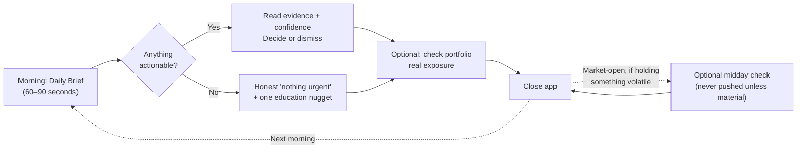

# Mobile Product Masterplan
## Office of the Chief Product Officer & Chief Customer Officer — ImpactOne Mobile

**Mandate:** Design the complete mobile experience that makes a person open ImpactOne every morning — not because they are anxious about money, but because it is the calmest, clearest 90 seconds of their day. This document does not discuss code, screens-as-components, or engineering sequencing. It discusses what a human does, thinks, and feels, minute by minute, from the first tap to the thousandth.

**North Star:** *A user who opens ImpactOne once a day, every day, for a reason that has nothing to do with fear.* Not session count. Not time-in-app — time-in-app is a warning sign in this product, not a win condition (see `VISION.md`: "never optimize for trading frequency over user outcomes"). The measure of success is a habit built on trust, not a habit built on anxiety-checking, and this document is written to make that distinction operational, screen by screen.

**A challenge to prior work, stated up front:** `COMPANY_STRATEGY_REVIEW.md` recommended removing user-facing Committee Debate theater, macro/geopolitical world-map dashboards, and alt-data edge-seeking content as over-engineered for a beginner mission. This document agrees on macro world-maps and alt-data edge content — they are cut from the mobile experience entirely, below. It disagrees, in part, on Committee Debate: stripped of its "theater" (six personas performing disagreement for its own sake) and re-cast as a single, optional, collapsed "why we disagree" affordance under a recommendation, it is one of the few features that builds *earned* trust rather than borrowed confidence, and is kept — small, quiet, and never the headline.

---

## 1. Complete Onboarding Journey

Onboarding has exactly one job: get a first-time user to their own portfolio or watchlist showing one real, honest, sourced insight, in under two minutes, without asking them to understand a single piece of jargon first.

| Step | What happens | Why |
|---|---|---|
| 0. Pre-install | App Store listing shows a single real screenshot of a recommendation with its evidence and confidence visible — not a marketing mockup. | Sets the trust expectation before install, not after. |
| 1. First screen | One sentence: *"See what's actually happening with your money, and why."* One button: **Get started.** No email wall yet. | Removes the single biggest early-abandonment point in finance apps: being asked to commit before seeing value. |
| 2. Who is this for | Three tappable cards: *"I'm new to investing," "I have some experience," "I manage my own portfolio actively."* | Branches tone and vocabulary depth immediately — a 16-year-old and a 45-year-old self-directed investor should never read the same onboarding copy. |
| 3. What matters to you | Pick up to 3 things to watch: a symbol, a theme (e.g., "AI," "Energy"), or "just show me what's important today." | Guarantees the first real screen has personally relevant content, not a generic market feed. |
| 4. Risk & horizon, in plain language | Two sliders with real-world anchors ("I'd panic if this dropped 10% this month" ↔ "I won't check for years"), not a risk-tolerance questionnaire with financial jargon. | Feeds sizing and tone, never gatekeeps access. |
| 5. Account (deferred) | Account creation happens *after* step 6, not before — a session token holds state until then. | The user has already seen value before being asked to commit an email/password. |
| 6. First real insight | The app shows one real, current, sourced insight matching what they picked in step 3 — evidence visible, confidence visible, one plain-language sentence explaining why it matters to them specifically. | This is the entire point of onboarding: prove the product's honesty claim with a real example before asking for anything else. |
| 7. The one promise | A single, permanent, dismissible-but-always-revisitable card: *"We will never tell you we're sure when we're not, and we'll never place a trade for you."* | States the two core trust invariants (`VISION.md`) in the user's own moment of first trust formation, not buried in terms of service. |

**Maximum time to first real insight: 90 seconds.** **Maximum taps to first real insight: 7.**

---

## 2. First Launch Experience

The very first thing a returning (post-onboarding) user sees is never a loading spinner and never a blank dashboard. It is always one of: a fresh daily brief item, a portfolio change worth knowing about, or — on a quiet day — an explicit, honest "nothing urgent today" state with one piece of ongoing education. A first launch that shows nothing, or shows a spinner for more than 400ms, is treated as a defect with the same severity as a factual error, because it is the single moment that decides whether tomorrow's open happens at all.

---

## 3. First Five Minutes

| Minute | Experience |
|---|---|
| 0:00–0:30 | App opens directly to Home — no interstitial, no ad, no "rate us" prompt. One clear headline: what changed, why it matters to *this* user. |
| 0:30–1:30 | User taps the headline item. Sees evidence (sourced, tiered), confidence and uncertainty shown as two honest numbers, not one confident-sounding blend, and the plain-language "why this matters to you." |
| 1:30–3:00 | User explores one adjacent thing: their portfolio's real exposure to what they just read, or a related theme. No dead ends — every insight links to at least one next honest step. |
| 3:00–5:00 | User either sets a watchlist item, asks a follow-up question in plain language, or closes the app satisfied. All three are success states. Only silent, confused closing (no action taken, no scroll, immediate exit) is a failure state to instrument and reduce. |

---

## 4. Daily Habit Loop

The loop is designed to be **satisfiable in under two minutes on most days**, and to never manufacture urgency on quiet days. A habit loop that only works by inventing daily drama is not a habit — it is a dependency, and this product explicitly refuses to build one (`VISION.md`: "no manufactured urgency").

---

## 5. Morning Routine

**Trigger:** A single, optional, user-controlled notification at a time the user picked during onboarding (never a default 7:00 AM blast to everyone). **Content:** one sentence, no cliffhanger copy ("You'll want to see this" is banned — say the actual thing). **Destination:** directly into the specific Daily Feed item, never a generic app-open. **Duration target:** under 90 seconds to feel informed and safe to move on with the day.

---

## 6. Market-Open Routine

For the minority of users who hold individual positions with real intraday volatility, one optional, off-by-default toggle: a single check-in prompt at market open, only if something material changed overnight (never a routine "market opened" ping — that is noise, not information). For everyone else, market open produces no notification at all. **Silence is the default and the respectful choice**, not an omission to fix later.

---

## 7. Weekend Routine

Weekends have no live market to react to, and the product should never pretend otherwise. Saturday/Sunday content shifts entirely to: a plain-language explainer of one thing that happened during the week, a short piece of investing education tied to something in the user's own portfolio, or — for engaged users — an invitation to review and adjust their watchlist. **No urgency framing is permitted on weekends under any circumstance.** This is the one guaranteed calm window in the week, and it is protected as such deliberately.

---

## 8. Monthly Portfolio Review

Once a month, a dedicated, unhurried surface (not a notification interruption) surfaces: what changed in the user's actual holdings over the month, which of the platform's own past calls on their symbols were graded correct/incorrect/still-pending (real track record, including the misses — `VISION.md`: "show the track record, including the bad parts"), and one honest, non-pushy prompt to revisit risk tolerance or goals if life circumstances might have changed. This is the single most important trust-building surface in the entire product, because it is the one place the platform is graded by its own past claims in front of the user, on a fixed and predictable cadence.

---

## 9. Portfolio Growth Journey

A user's relationship with the product is expected to change over years, and the product must visibly change with it rather than freezing them at "beginner" forever:

1. **Curious (Weeks 1–4):** Learning what the numbers mean. Every screen offers a plain-language "what does this mean" affordance. Confidence and uncertainty are explained inline, not assumed understood.
2. **Building trust (Months 2–6):** The user has seen at least one graded outcome, correct or incorrect, and seen the platform be honest about it either way. Education nudges shrink; the user starts skipping the "what does this mean" prompts because they no longer need them — this is measured and treated as a positive signal, not ignored as reduced engagement.
3. **Confident (Year 1+):** The user checks less often, not more — a materially good sign in this product specifically — and increasingly uses the platform to *validate* their own thinking rather than to be told what to think. Portfolio review becomes the primary surface; the daily brief becomes a background layer they trust enough not to need to check every day.
4. **Mentor (Year 2+):** The user starts explaining concepts to someone else (a teenager, a parent, a partner) using ImpactOne's own plain-language explanations, often without realizing they're quoting the product. This is the moment referral becomes organic (see `FIRST_100_USERS_PLAYBOOK.md`) and the moment the product's real long-term success metric — *"a user who needs to check less"* — is fully realized, not a paradox to explain away.

---

## 10. Screen-by-Screen Review

| Screen | Purpose | Primary action | Secondary action | Success metric | Max interaction time | Exit state |
|---|---|---|---|---|---|---|
| **Home** | Answer "do I need to do anything today" in one glance | Open the day's one headline item | Jump to portfolio or watchlist | % of sessions that end here satisfied, without further navigation | 30 seconds | Calm close, no unresolved question |
| **Daily Feed** | Show what happened and why it matters, ranked by relevance to this user | Read/expand an item's evidence | Dismiss/mute a topic | % of items read to evidence, not just headline | 90 seconds | User has either acted, dismissed, or explicitly saved for later — never a silent scroll-away |
| **AI Analysis** | Deep-dive on one symbol: evidence, confidence, uncertainty, bull/bear case | Read the full evidence chain | Add to watchlist / compare to holdings | % of analyses where the user views both supporting and opposing evidence | 3 minutes | User has a specific answer to "why," not just a score |
| **Recommendations** | Show the one canonical action ImpactOne would consider, with full justification | Accept / dismiss with reason | View decision trace (evidence, confidence, invalidation condition) | % of recommendations where invalidation condition is viewed at least once | 2 minutes | User understands what would make this wrong, not just what would make it right |
| **Themes** | Track a standing narrative (AI, Energy, etc.) and what's exposed to it | Follow/unfollow a theme | See which of my holdings are exposed | % of followed themes with at least one holding mapped | 60 seconds | User knows their real exposure, not just an abstract trend |
| **Portfolio** | Show real, current exposure and performance, honestly, including underperformance | Review a position | Run a stress scenario | % of visits including at least one non-price data point viewed (exposure, concentration) | 90 seconds | User leaves knowing their real risk, not just their return |
| **Profile** | Reflect who this user is (risk tolerance, horizon, goals) back to them, adjustable anytime | Adjust risk/horizon | Review past decisions history | Time since last profile drift check | 60 seconds | Profile still matches how the user actually feels about risk today |
| **Settings** | Control notifications, data, and account — nothing hidden | Adjust notification cadence | Manage connected data/export | Zero support tickets asking "how do I turn this off" | 45 seconds | User feels in control, not managed |
| **Notifications** | A visible, editable log of everything the app has ever pushed, not just a settings toggle | Review recent notifications | Mute a specific category | % of users who never need to ask "why did I get this" | 30 seconds | User trusts every future notification because they can audit past ones |

---

## 11. Reduce / Increase

**Reduce, deliberately and measurably:**
- **Cognitive load:** never show more than one confidence-bearing number without a label; never require the user to hold more than 3 pieces of information in their head to understand a screen.
- **Confusion:** every technical term (confidence, uncertainty, thesis, exposure) has an inline, one-tap plain-language explanation the first three times it's seen, then quietly stops appearing once the user has demonstrated they understand it (see §9).
- **Clicks:** no core daily action (read the brief, check the portfolio, dismiss an item) requires more than 2 taps from Home.
- **Scrolling:** the daily brief is capped to what matters — quantity is never a proxy for value; a 3-item honest brief beats a 12-item padded one every time.

**Increase, deliberately and measurably:**
- **Trust:** every number shown is explained, every claim is sourced, every past claim is gradable and shown including misses.
- **Speed:** Home-to-insight in under 2 seconds of perceived load time on any screen, always with a real skeleton state, never a spinner with no shape.
- **Clarity:** confidence and uncertainty are always shown as two separate, honestly-labeled things — never blended into one reassuring-sounding number (this is a hard product requirement, not a suggestion — see `DESIGN_SYSTEM_V2.md` §"Confidence Visualization").
- **Daily engagement, honestly measured:** the metric that matters is *daily opens that end in a satisfied close*, not session length or screens-per-session — a product optimizing session length in this category is optimizing for the wrong outcome and this document explicitly refuses to do it.

---

## 12. The Next 50 Product Improvements, Ranked by Impact

**Tier 1 — Trust and stability foundations (must happen before anything else compounds):**

| Rank | Improvement | Why it matters most |
|---|---|---|
| 1 | Fix dashboard load-time layout/reflow instability (previously observed: sidebar overtaking viewport, page unstable for an extended period post-load) | A product that visibly breaks on open cannot build any habit at all — this blocks every other improvement below |
| 2 | Build real onboarding (currently absent — users land directly in a "Guest workspace") | The single biggest reason a first-time user never returns |
| 3 | Reconcile the AI Analysis screen's remaining unreconciled rating pills into one canonical verdict, end to end | Multiple disagreeing-looking numbers on one screen is a trust failure the moment a sharp user notices it |
| 4 | Ship the confidence/uncertainty dual-display everywhere a score currently appears alone | Directly enforces the platform's own epistemic standard in the UI, not just in backend data |
| 5 | Add a persistent, one-tap "why did I get this notification" trace | Removes the single most common cause of notification distrust |
| 6 | Add real account/session identity (today: single global guest state) | Nothing below scales past a handful of test users without this |
| 7 | Add a visible, honest track record surface (calibration, including misses) | The single highest-leverage trust-building feature available |
| 8 | Add plain-language glossary tooltips on every jargon term, first-three-times-then-fade | Removes the single largest comprehension barrier for beginner users |
| 9 | Add explicit invalidation-condition display on every recommendation | Currently the least-visible, most important piece of evidence a user needs |
| 10 | Add graceful degraded states everywhere a provider can fail (no blank screens, no raw errors) | Every silent failure is a silent trust cost |

**Tier 2 — Daily engagement and comprehension:**

| Rank | Improvement |
|---|---|
| 11 | Ship the Daily Brief cap-and-rank logic (quality over quantity) |
| 12 | Add a one-tap "explain like I'm new to this" toggle on every screen |
| 13 | Add real portfolio exposure computation (replace hardcoded sector assumptions) |
| 14 | Add a dedicated Monthly Portfolio Review surface |
| 15 | Add theme-to-holdings mapping on the Themes screen |
| 16 | Add a collapsed, optional "why we disagree" affordance under recommendations (Committee Debate, de-theatricalized) |
| 17 | Add weekend-mode content (education, not market noise) |
| 18 | Add a first-run "what does this number mean" walkthrough triggered contextually, not as a forced tutorial |
| 19 | Add dismiss-with-reason on Daily Feed items (feeds personalization honestly) |
| 20 | Add a visible evidence-source badge (tier/class) on every cited item |
| 21 | Add stress-test / scenario view on Portfolio |
| 22 | Add risk-tolerance drift check-ins tied to major life-event prompts |
| 23 | Add a "what would prove this wrong" section to every Thesis-linked recommendation |
| 24 | Add dark mode with true semantic tokens (not just inverted colors) |
| 25 | Add accessibility pass (dynamic type, screen reader labels on every evidence/confidence element) |

**Tier 3 — Retention, referral, and long-term trust compounding:**

| Rank | Improvement |
|---|---|
| 26 | Add a referral moment triggered by a graded-correct outcome, not by a generic "invite friends" banner |
| 27 | Add a family/mentor mode (a parent or mentor can see a simplified, permissioned view of a teen's learning progress, never their financial data by default) |
| 28 | Add an annual "here's what we got right and wrong this year" surface |
| 29 | Add a community/education layer for shared, anonymized learning (never shared portfolios) |
| 30 | Add notification cadence self-tuning based on observed engagement, always user-overridable |
| 31 | Add a "quiet mode" that suppresses all non-critical notifications during a user-declared stressful period |
| 32 | Add multi-language support starting with the largest underserved beginner audiences |
| 33 | Add a widget (home screen) showing one honest daily line, not a ticking price |
| 34 | Add Apple Watch / lock-screen glanceable daily brief summary |
| 35 | Add export/portability of a user's own decision history |
| 36 | Add a "compare my thinking to the platform's" reflective journaling feature |
| 37 | Add theme-following streaks that reward *understanding*, not trading frequency |
| 38 | Add a "surprise me with something I didn't know I should care about" discovery surface |
| 39 | Add cross-device continuity (start on phone, finish review on tablet/desktop) |
| 40 | Add a "explain this like I'm 65 and new to apps" alternate tone/complexity mode |
| 41 | Add household/family portfolio view (aggregate, permissioned, never merged financially) |
| 42 | Add a "what changed since I last looked" diff view on Portfolio |
| 43 | Add proactive, honest "we don't have enough data yet" states instead of guesses |
| 44 | Add a public, versioned changelog of platform methodology changes (a trust artifact, not a feature) |
| 45 | Add international market coverage prioritized by where underserved users actually are, not by market cap |
| 46 | Add a teen-specific simplified vocabulary track distinct from the adult track |
| 47 | Add offline/poor-connectivity graceful states for the Daily Brief |
| 48 | Add a "second opinion" mode that shows how confident the platform would be with one fewer piece of evidence (methodological transparency as a feature) |
| 49 | Add University/campus-specific onboarding cohorts (see `GROWTH_PLAYBOOK.md`) |
| 50 | Add a public API/data-export for power users who want to build their own views on top of ImpactOne's evidence (a long-horizon trust and ecosystem play, last precisely because it matters least to the first million users) |
