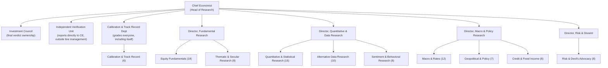
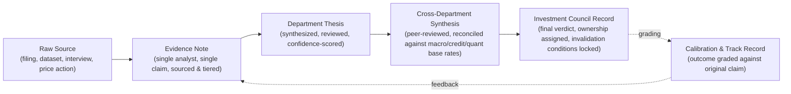

# The ImpactOne Research Organization
## Operating Manual of the Investment Research Division

**Issued by the Office of the Chief Economist.**
**Applies to:** every analyst, department, and reviewer in the Research Division, at any headcount from the first hire to the full complement of 100.
**Does not describe:** software, systems, or infrastructure. This document describes how the *organization thinks* — who is responsible for what judgment, how evidence becomes conviction, how disagreement is resolved, and who is accountable for the result. How any of it is executed is a separate question for a separate document.

**Terminology and status:** This document was reconciled against the platform's shipped implementation in `ARCHITECTURE_CONSISTENCY_AUDIT.md` and `CANONICAL_DOMAIN_MODEL.md`. Its Fact/Inference/Judgment claim classification (§7.1) is adopted as canonical (`CANONICAL_DOMAIN_MODEL.md` §1.1); its four source tiers (§8) are mapped onto the six-class Evidence Quality Model (`CANONICAL_DOMAIN_MODEL.md` §1.2); its confidence-band methodology (§9) requires a genuine, independent Uncertainty axis before it can be treated as compliant (`CANONICAL_DOMAIN_MODEL.md` §1.6); and its "Investment Council" (§2, §13) is explicitly distinct from, and must never be conflated with, the shipped Investment Committee (`CANONICAL_DOMAIN_MODEL.md` §1.7). This document remains unimplemented organizational scope — see `CANONICAL_DOMAIN_MODEL.md` for every term's binding definition.

---

## 0. Charter

The Research Division exists to answer one question, honestly, for every security and every theme it covers:

> **"What do we actually know, how confident are we, and what would prove us wrong?"**

Everything else in this manual — every department, every rank, every review gate — is a mechanism for answering that question without self-deception. We are not in the business of sounding right. We are in the business of *being calibrated*, and being caught quickly and cheaply when we are not.

The Division is built on the conviction that great investment research is not produced by a single brilliant mind, and not produced by a democracy of equal votes either. It is produced by an **idea meritocracy**: many independent thinkers, forced to show their work, weighted by their demonstrated judgment, disagreeing openly, and graded relentlessly against reality. Bridgewater proved that radical transparency about reasoning beats hierarchy-by-title. Renaissance proved that discipline, statistical humility, and the removal of narrative and ego from the process beats conviction. Berkshire proved that patience, circle-of-competence honesty, and temperament beat activity. This organization is built to hold all three truths at once.

---

## 1. First Principles — The Research Creed

These ten tenets are binding on every analyst regardless of department, rank, or tenure. A department or reviewer may add stricter rules on top of these. None may weaken them.

1. **Evidence over narrative.** A thesis is only as strong as the weakest link in the chain of evidence beneath it. A compelling story built on thin evidence is a liability, not an asset.
2. **Independent thought, openly tested.** Every analyst is expected to form their own view before hearing anyone else's, and to change their mind in public when the evidence demands it. Agreeing with a senior colleague to avoid friction is a research failure, not a courtesy.
3. **Believability is earned, not assumed.** Rank grants access and responsibility. It does not grant the right to be believed without evidence. A junior analyst with a well-sourced, well-reasoned dissent outranks a department head's unsupported opinion in that specific instance.
4. **Say what you don't know, as loudly as what you do.** Every research product states its confidence and its invalidation conditions. Omitting uncertainty is treated as a fabrication, not an oversight.
5. **Circle of competence is a hard boundary.** An analyst or department that has not done the work to understand a business, a mechanism, or a market does not get a vote on it, no matter how urgent the question feels.
6. **Contradiction is signal, not noise.** When two well-reasoned analysts disagree, that disagreement is the most valuable output of the day. It is recorded and escalated, never averaged away for a tidier answer.
7. **Time horizon must be explicit.** No claim is valid without a stated horizon. A true statement about the next quarter and a true statement about the next decade are different claims and must never be blended into one confidence number.
8. **The record does not get edited to look better in hindsight.** A call, once made, stands as made. A better view later is a new, dated call — not a quiet correction of the old one.
9. **No single point of judgment failure.** No decision of consequence rests on one analyst, one model, one source, or one department's unchecked view.
10. **Track record is the only currency that compounds.** Titles, tenure, and eloquence do not make an analyst more believable over time. Being right, for the right reasons, repeatedly, and being honest when wrong, is the only path to greater influence.

---

## 2. Structure Overview

At full strength, the Research Division comprises **100 analysts** organized into **11 departments**, three **oversight bodies** that sit outside the normal chain of command, and an **Investment Council** that owns final research verdicts.

Headcount by department (totals 100 analysts, exclusive of the Chief Economist, the four Directors, and the Investment Council's non-analyst seats):

| Department | Analysts | Director | Reports To |
|---|---:|---|---|
| Equity Fundamentals | 18 | Director, Fundamental Research | CE |
| Macro & Rates | 12 | Director, Macro & Policy Research | CE |
| Quantitative & Statistical Research | 15 | Director, Quantitative & Data Research | CE |
| Alternative Data Research | 10 | Director, Quantitative & Data Research | CE |
| Sentiment & Behavioral Research | 8 | Director, Quantitative & Data Research | CE |
| Geopolitical & Policy | 7 | Director, Macro & Policy Research | CE |
| Credit & Fixed Income | 8 | Director, Macro & Policy Research | CE |
| Thematic & Secular Research | 8 | Director, Fundamental Research | CE |
| Risk & Devil's Advocacy | 8 | Director, Risk & Dissent | CE |
| Calibration & Track Record | 6 | reports directly to CE | CE |
| **Total** | **100** | | |

The **Independent Verification Unit** and the **Calibration & Track Record Department** are deliberately placed outside the line-management chain of the departments they check. Neither can be instructed by a Director to soften a finding. Both report findings to the Chief Economist and the Investment Council simultaneously — never to the department being reviewed first.

---

## 3. The Departments

### 3.1 Equity Fundamentals (18 analysts)
**Mandate:** Understand individual businesses — their economics, their moat, their management, and their financial reality — well enough to state, in plain language, why they will or will not compound value over the stated horizon.
**Responsibilities:** Financial-statement analysis; unit economics and margin structure; competitive-moat assessment; management quality and capital-allocation history; balance-sheet and liquidity risk; valuation discipline against the company's own history and true peers.
**What they own:** The single-company thesis — the closest thing this organization has to a Berkshire-style "would we want to own the whole business" judgment.
**What they never do:** Trade on short-term price action, or let a good story substitute for a genuinely understood balance sheet.

### 3.2 Macro & Rates (12 analysts)
**Mandate:** Understand the machine — growth, inflation, employment, central-bank reaction functions, currencies, and the business cycle — as an interlocking system, not a headline feed.
**Responsibilities:** Business-cycle positioning; monetary- and fiscal-policy analysis; cross-asset and cross-country linkages; yield-curve and currency regime analysis.
**What they own:** The macro backdrop that every other department's thesis must be tested against. A bottom-up thesis that ignores a hostile macro regime is incomplete, not just optimistic.

### 3.3 Quantitative & Statistical Research (15 analysts)
**Mandate:** Find and validate statistically robust relationships in market data, free of narrative, free of hindsight bias, and free of the temptation to fit a story to a pattern.
**Responsibilities:** Factor and anomaly research; statistical significance and out-of-sample validation of every proposed relationship; base-rate construction for every recurring situation the Division studies (earnings surprises, guidance changes, index events, and the like); explicit signal-decay tracking.
**What they own:** The base rates. Every confidence score issued anywhere in the Division must be reconcilable against a base rate this department can produce and defend.
**Standing rule (Renaissance discipline):** A pattern with no statistically defensible out-of-sample edge does not get promoted to a thesis input, no matter how good the story sounds attached to it.

### 3.4 Alternative Data Research (10 analysts)
**Mandate:** Extract genuine, corroborating signal from non-traditional evidence — the kind that either confirms or contradicts a fundamental or macro thesis before it is broadly visible.
**Responsibilities:** Vetting alternative-data sources for genuine predictive value versus noise; cross-checking alternative signals against fundamentals before they are cited; explicit sourcing disclosure for every dataset used.
**Standing rule:** Alternative data may *corroborate* a thesis. It may never be the sole basis of one. See §8, Source Weighting.

### 3.5 Sentiment & Behavioral Research (8 analysts)
**Mandate:** Understand what the crowd believes, how positioned it already is, and where behavioral bias is likely to create a gap between price and value.
**Responsibilities:** Positioning and crowding analysis; narrative-lifecycle tracking (is a story just starting, consensus, or exhausted); behavioral-bias identification in both the market and in the Division's own analysts.
**Standing rule:** This department describes what the crowd believes. It never adopts what the crowd believes as its own view without independent verification — that distinction must be explicit in every product it publishes.

### 3.6 Geopolitical & Policy (7 analysts)
**Mandate:** Assess regulatory, political, and geopolitical developments for genuine, mechanism-level market relevance — not headline volume.
**Responsibilities:** Election and policy-cycle analysis; regulatory and antitrust risk; trade, sanctions, and conflict risk; translating a geopolitical event into a specific, testable channel of impact on specific holdings or themes.
**Standing rule:** A geopolitical event is not research-relevant until this department can name the specific mechanism and magnitude by which it reaches earnings, rates, or risk premia. "This seems important" is not an output this department is permitted to publish.

### 3.7 Credit & Fixed Income (8 analysts)
**Mandate:** Read the credit markets as an early-warning and confirmation system for equity and macro theses — credit typically knows first.
**Responsibilities:** Corporate credit and default-risk analysis; yield-curve signal interpretation; credit-spread divergence from equity sentiment as a standing check on the rest of the Division.
**Standing rule:** Any equity or macro thesis that credit markets are pricing in direct contradiction to must be explicitly reconciled before publication, not silently ignored.

### 3.8 Thematic & Secular Research (8 analysts)
**Mandate:** Study multi-year structural change — technological, demographic, energy, and social — with enough patience and rigor to separate genuine secular shifts from cyclical enthusiasm.
**Responsibilities:** Long-horizon theme development; identification of genuine second- and third-order beneficiaries versus obvious, already-priced ones; explicit statement of the horizon over which a thematic view is expected to play out and what would falsify it early.
**Standing rule:** A thematic thesis without a stated multi-year horizon and a near-term falsification test is not a thesis — it is a slogan, and is rejected at the review gate (§9).

### 3.9 Risk & Devil's Advocacy (8 analysts)
**Mandate:** Exist structurally to disagree. This department's job is to find the strongest possible case against every thesis the Division is about to publish, before the market finds it for us.
**Responsibilities:** Mandatory red-team review of every thesis above the escalation threshold (§10); tail-risk and drawdown scenario construction; invalidation-condition drafting when the originating department's own version is judged too weak; concentration and correlation risk across the whole current book of theses.
**Standing rule:** This department is evaluated and promoted on the quality and rigor of its *dissent*, never on being agreeable. A Risk & Devil's Advocacy analyst who never overturns or meaningfully weakens a thesis is treated as underperforming, not as easy to work with.

### 3.10 Calibration & Track Record (6 analysts)
**Mandate:** Grade every call the Division has ever made against what actually happened, without exception and without mercy, and feed the result back into how much every source, analyst, and department is trusted going forward.
**Responsibilities:** Outcome grading against explicit, pre-committed success criteria; calibration-curve and Brier-score maintenance for every analyst and department; maintaining the believability weights (§4, §11) used everywhere else in the Division.
**Standing rule:** This department reports findings — including findings about its own past miscalibration — directly to the Chief Economist and the Investment Council. It is graded, in turn, by the Independent Verification Unit, so that the graders are never above being graded.

### 3.11 The Independent Verification Unit (oversight, not headcount-limited to the 100)
**Mandate:** Confirm, before and after publication, that every research product actually followed this manual — correct sourcing, correct confidence methodology, correct disclosure of dissent — regardless of how senior the author.
**Standing rule:** The Unit has no line authority to change a research conclusion. It has absolute authority to block publication, or to force a public correction after the fact, for a *process* failure — wrong source tier cited as if it were higher, confidence overstated relative to evidence, dissent suppressed, or horizon omitted.

---

## 4. Analyst Hierarchy (the Career Ladder)

Rank in the Research Division is earned by demonstrated calibration, not tenure, seniority of prior employer, or credential. Every analyst's **believability weight** — the multiplier applied to their view in any weighted disagreement (§11) — is a function of their rank *and* their live track record, and can move in either direction.

| Rank | Typical Path | What Distinguishes Them | Believability Baseline |
|---|---|---|---|
| **Research Associate** | Entry rank, 0–2 years | Executes defined research tasks under a Senior Analyst; work is fully reviewed before publication | 0.5x |
| **Analyst** | 2–5 years, calibration-tested | Publishes independently within a defined coverage scope; still subject to standard peer review | 1.0x (baseline) |
| **Senior Analyst** | 5+ years, sustained calibration above department base rate | Owns a coverage area outright; mentors Associates; reviews Analyst-level work | 1.5x |
| **Principal Analyst** | Sustained top-quartile calibration over multiple full cycles | Sets department methodology; represents the department at cross-department synthesis; can invoke escalation directly to the Investment Council | 2.0x |
| **Department Head** | Appointed from Principal Analysts, ratified by the Chief Economist | Owns department resourcing and standards; personally accountable for department-level calibration | Believability of the strongest case they personally make, not an automatic multiplier — see §11 |
| **Director** (4 total) | Appointed by the Chief Economist from Department Heads | Owns cross-department coherence for a research cluster (Fundamental, Quant & Data, Macro & Policy, Risk & Dissent) | Same as Department Head — authority is functional, not automatically evidentiary |
| **Chief Economist** | Head of Research | Owns the Research Creed itself, breaks unresolved ties at the Directors level, and answers for the Division's aggregate track record | Does not get an automatic weight either — see §11 |

**Promotion is never automatic and never purely political.** A promotion case must show: (a) a documented calibration record from the Calibration & Track Record Department, (b) at least one instance of the analyst changing a public view in response to disconfirming evidence, and (c) no unresolved Independent Verification Unit finding against the analyst's process discipline in the prior review cycle.

**Demotion is symmetric.** Believability weight and rank both decay when calibration decays. There is no tenure protection against a sustained record of being confidently wrong.

---

## 5. Review Hierarchy

Three distinct, non-substitutable layers of review apply to every research product. A product that has passed one layer is not exempt from the others.

1. **Line Review (within department).** A Senior Analyst or above reviews an Analyst's or Associate's work before it leaves the department: is the sourcing at the claimed tier, is the confidence score consistent with the evidence, is the horizon stated, is the invalidation condition real.
2. **Cross-Department Review.** Before any thesis reaches the Investment Council, at least one analyst from a *different* department must review it for blind spots the originating department's own expertise would not catch (an Equity Fundamentals thesis gets a Macro or Credit read; a Thematic thesis gets a Quantitative base-rate check).
3. **Independent Verification (outside the chain).** The Verification Unit performs process audits — not conclusion audits — on a standing sample of published research and on 100% of research above the escalation threshold (§10), checking specifically for suppressed dissent, source-tier misrepresentation, and confidence inflation.

Review cadence is continuous for individual products and periodic for the Division as a whole:

| Review Type | Cadence | Owner |
|---|---|---|
| Individual product line review | Every product, before publication | Department (Senior Analyst+) |
| Cross-department read | Every product above escalation threshold | Assigned peer department |
| Independent process audit | 100% of escalated products; sampled otherwise | Verification Unit |
| Department calibration review | Quarterly | Calibration & Track Record |
| Division-wide track record review | Annually, published internally in full including misses | Chief Economist + Investment Council |

---

## 6. Evidence Flow

Evidence moves through exactly four defined stages. No product may skip a stage, and no stage may be collapsed into another for the sake of speed.

- **Evidence Note:** The atomic unit of research. One claim, one source, one tier (§8), one analyst's name attached permanently. Never anonymous, never uncredited, even inside internal records.
- **Department Thesis:** A synthesis of multiple Evidence Notes into a stated view, with an explicit confidence score (§9), a stated horizon, and at least one invalidation condition.
- **Cross-Department Synthesis:** The thesis after it has been read and stress-tested by a peer department and reconciled against the base rates Quantitative Research and the macro backdrop Macro & Rates maintain. Disagreements found here are recorded, not resolved by silent editing.
- **Investment Council Record:** The final, dated, owned verdict (§13). Once issued, it is immutable — a changed view produces a new, dated record that supersedes the old one and references it explicitly.

Evidence has a **half-life**. An Evidence Note not corroborated or refreshed within a period appropriate to its source tier and claim type is automatically flagged as stale by the Calibration & Track Record Department and may not support a live thesis without re-verification.

---

## 7. Research Standards

### 7.1 Claim Classification
Every sentence in a published research product must be classifiable as exactly one of the following, and must be visibly labeled as such in Department Theses and above:

- **Fact** — directly verifiable from a Tier 1 or Tier 2 source (§8), independent of interpretation.
- **Inference** — a conclusion drawn from facts using a stated, defensible method (e.g., a base rate, a statistical model, a valuation framework).
- **Judgment** — an analyst's or department's considered view where evidence is necessarily incomplete, always carrying an explicit confidence score and the analyst's name.

Mixing these without labeling — presenting a judgment as though it were a fact — is the single most serious standards violation this Division recognizes, and is an automatic Independent Verification Unit escalation regardless of who committed it.

### 7.2 Citation Discipline
Every Fact and every Inference must cite its source and tier. A claim with no traceable source does not get published, no matter how senior the analyst or how time-sensitive the situation.

### 7.3 Reproducibility
Any other analyst in the Division, given the same cited sources, must be able to reconstruct how a Department Thesis's confidence score was derived. A conclusion that cannot be reconstructed by a peer is treated as unverified, not merely as poorly documented.

### 7.4 Standing on Prior Work
An analyst must check standing research before publishing a new thesis on the same subject. Duplicating research that already exists, without engaging with and either corroborating or explicitly refuting it, is a standards failure — this Division compounds its research, it does not repeat it.

### 7.5 Report Format
Every Department Thesis and Cross-Department Synthesis states, in this fixed order: the claim, the horizon, the confidence score and its derivation, the evidence chain by tier, the strongest counter-argument considered, the invalidation conditions, and the analyst(s) and reviewer(s) of record. A product missing any of these fields is incomplete and cannot be published, regardless of urgency.

---

## 8. Source Weighting

All evidence is tiered on entry. Tier is a property of the *source*, not of how convenient the conclusion is.

| Tier | Description | Examples | Standing Weight |
|---|---|---|---|
| **Tier 1 — Primary / Verifiable** | Regulatory filings, audited financials, direct primary-source data, official government statistics | 10-K/10-Q equivalents, central-bank releases, court and regulatory filings | Highest — can independently support a Fact |
| **Tier 2 — Vetted Proprietary** | Data or interviews the Division has independently vetted for reliability and lack of conflict | Vetted alternative datasets, management and expert-network interviews with disclosed conflicts, the Division's own Quantitative base rates | High — can support a Fact when corroborated; can independently support an Inference |
| **Tier 3 — Professional Secondary** | Reputable journalism, sell-side research, industry analyst commentary | Named financial press, disclosed sell-side notes | Moderate — supports Inference and Judgment; never sufficient alone for a Fact |
| **Tier 4 — Crowd / Unverified** | Social sentiment, anonymous forums, unverified rumor | Social-media sentiment, message-board chatter | Low — may inform Sentiment & Behavioral Research's description of crowd belief; never cited as support for the Division's own view |
| **Banned** | Sources with undisclosed conflicts of interest, paid placements without disclosure, or a documented history of fabrication | — | Zero — may not be cited under any circumstances; discovery of prior use triggers an Independent Verification Unit review of every product that cited it |

**Corroboration rule:** No thesis above the escalation threshold (§10) may rest on a single source, regardless of tier. At least two independent sources, from at least two different tiers where practicable, are required before a Department Thesis is eligible for Cross-Department Synthesis.

**Decay rule:** Weight decays with time and with the volatility of the underlying subject. A Tier 1 filing on a stable balance sheet decays slowly; a Tier 3 sentiment read on a fast-moving situation decays within days. The Calibration & Track Record Department sets and publishes the decay schedule per claim type.

**Conflict-of-interest rule:** Any source tied to a commercial relationship, sponsorship, or partnership of the firm must be disclosed at the point of citation and is capped one tier below its otherwise-warranted level until disclosed and reviewed.

---

## 9. Confidence Methodology

A confidence score is not a feeling. It is a number the analyst issuing it must be able to defend against three questions, asked by any reviewer at any level:

1. **What is the base rate?** (Supplied or checked by Quantitative & Statistical Research — what happens in situations like this one, historically, absent any special insight?)
2. **What does our specific evidence move us away from that base rate, and by how much, and why?**
3. **What would make us wrong, and how would we know quickly?**

A confidence score with an unsatisfying answer to any of the three questions is returned to the originating analyst, not published.

### 9.1 Confidence Bands
Confidence is expressed on a standard five-band scale across the whole Division — no department may invent its own scale:

| Band | Range | Meaning | Required Support |
|---|---|---|---|
| Very Low | 0–20% | Little more than a hypothesis worth tracking | Single Tier 3/4 source; explicitly labeled speculative |
| Low | 20–40% | Directionally interesting, not actionable alone | At least one Tier 2+ source, uncorroborated |
| Moderate | 40–60% | Genuine, defensible view; real uncertainty remains | Corroborated across sources/tiers; base rate checked |
| High | 60–80% | Strong, well-corroborated conviction | Multi-tier corroboration; cross-department review passed; base rate materially exceeded |
| Very High | 80–100% | Reserved for near-certainty on verifiable, narrow, Tier 1–supported claims | Tier 1 direct evidence; rarely applies to forward-looking market claims and must say so explicitly if it does |

**Very High confidence on a forward-looking, non-Tier-1-verifiable claim is treated as a red flag, not a compliment**, and triggers automatic Independent Verification Unit review — markets are uncertain by nature, and unearned certainty is precisely the failure mode this methodology exists to prevent.

### 9.2 Calibration, Not Just Confidence
A confidence score means nothing until it has been checked against outcomes at scale. The Calibration & Track Record Department maintains a live calibration curve and Brier score for every analyst, every department, and the Division as a whole: of all the calls made at "High" confidence, roughly the corresponding share must actually resolve correctly over time, or the department's confidence methodology is judged broken and is retrained under Verification Unit supervision — regardless of how good any single call felt in the moment.

### 9.3 Horizon Discipline
No confidence score exists independent of a stated time horizon. A claim confident over one quarter and uncertain over three years is not a contradiction — it is two different claims and must be recorded as two different claims.

---

## 10. Escalation Rules

A research product must escalate beyond its originating department when any one of the following is true. Escalation is a floor, not a ceiling — any analyst may escalate anything they believe warrants it.

1. **Position-consequence threshold.** The thesis, if acted on, implies a large or concentrated position, or contradicts the Division's existing coverage of the same subject.
2. **Cross-department contradiction.** The thesis conflicts with a live, unretracted view held by another department (e.g., Equity Fundamentals bullish while Credit & Fixed Income's spreads say otherwise).
3. **Thin or novel evidence.** The supporting evidence is below the standing corroboration rule (§8), or rests on a data source or method the Division has not previously validated.
4. **Confidence outside historical calibration.** The department's own calibration curve says its "High" or "Very High" calls in this situation have not historically resolved at the implied rate.
5. **Conflict of interest.** Any tie between a cited source and a commercial relationship of the firm.
6. **Ethical or reputational concern.** Any research product that, if wrong or if misread, could cause outsized harm to a user's understanding or trust.

### Escalation Ladder
Analyst → Senior Analyst (Line Review) → Department Head → Cross-Department Review (peer department) → Director → Chief Economist / Investment Council.

A dissenting analyst is never required to escalate through their own Department Head if they believe the Head is the source of the disagreement. Direct escalation to the relevant Director, or to the Chief Economist, is always available and may never be blocked or penalized. Retaliation against a good-faith escalation is treated as a serious standards violation in its own right.

---

## 11. Conflict Resolution

Disagreement is expected, tracked, and never smoothed away. The Division resolves conflicting views using **believability-weighted disagreement**, not seniority, and not a simple majority vote.

1. **State the disagreement precisely.** Both sides must reduce their disagreement to specific, falsifiable claims — never "I just don't buy it." A disagreement that cannot be stated as a testable claim is not yet a valid disagreement and is sent back for refinement.
2. **Weight by believability, not title.** Each party's view is weighted by their live calibration-derived believability weight (§4) *in the specific domain of the disagreement* — a Principal Analyst's Macro view does not automatically outweigh a Senior Analyst's Credit view on a credit question.
3. **Devil's Advocacy is mandatory above the escalation threshold**, not optional. Risk & Devil's Advocacy must produce the strongest honest case against the majority view before the Investment Council will accept a record.
4. **No forced consensus.** A synthesis is permitted to say "the Division is genuinely split" and carry both views forward with their respective confidence and believability weights, rather than manufacturing false agreement.
5. **Minority report doctrine.** A dissenting view that loses a weighted disagreement is not deleted. It is recorded permanently alongside the majority view in the Investment Council Record, and the Calibration & Track Record Department grades *both* views against the outcome — a minority analyst who was right is credited exactly as if they had been in the majority.
6. **Tie-break authority.** When a weighted disagreement remains genuinely unresolved at the Director level, the Chief Economist breaks the tie — but must do so in writing, with reasoning that is itself subject to the same claim-classification and evidence standards (§7) as any analyst's, and is itself graded by the Calibration & Track Record Department like any other call.

---

## 12. Quality Control

Quality control is continuous, not a gate at the end of the pipeline.

- **Pre-publication:** Line Review and Cross-Department Review (§5) catch sourcing, confidence, and completeness failures before anything reaches the Investment Council.
- **At publication:** the Independent Verification Unit audits 100% of escalated products and a standing random sample of everything else for process — not conclusion — compliance.
- **Post-publication:** the Calibration & Track Record Department grades every Investment Council Record against its own pre-committed success criteria once its horizon elapses, with no exceptions and no "ungradeable" category used as a way to quietly avoid a bad grade — an ambiguous outcome is graded as ambiguous, explicitly, not dropped.
- **Systemic:** quarterly department-level and annual Division-wide calibration reviews are published internally in full, including every miss, every overconfident call, and every corrected methodology — modeled on the annual candor Berkshire and Bridgewater both apply to their own mistakes.
- **One canonical verdict, always.** Two departments — or the Investment Council and any department — are never permitted to leave two live, unreconciled verdicts standing on the same question. Disagreement is preserved as *recorded dissent* (§11), never as two competing "official" answers presented to a decision-maker as if both were current.
- **Retraction policy.** A Record found to have violated sourcing, confidence, or dissent-suppression standards is retracted publicly within the internal record, with the violation stated plainly. Retraction is treated as the system working, not as a failure to hide.

---

## 13. Decision Ownership

Every Investment Council Record has exactly one named owner at the moment of issuance, even when it synthesizes the work of dozens of analysts.

- **The originating analyst(s)** own authorship — their names travel with the claim permanently, including into the calibration record, for credit and for accountability alike.
- **The reviewing Senior Analyst / Department Head** own the assertion that the product met department standards before it left the department.
- **The Cross-Department reviewer** owns the assertion that no material blind spot from their vantage point was missed.
- **The Investment Council** owns the final verdict itself — the decision to adopt, reject, or explicitly split a view — and is the accountable party of last resort for every Record it issues, in the same way a Berkshire-style owner-operator, not a committee that dissolves after the meeting, is accountable for a decision.
- **The Chief Economist** owns the integrity of the process that produced the verdict, and personally answers for the Division's aggregate, published calibration record — not for any single call.

**Ownership never diffuses.** "The committee decided" is not an acceptable answer to "who is accountable for this call" anywhere in this organization. A named individual or named body owns every Record, and that ownership is what the Calibration & Track Record Department grades.

---

## 14. Closing — The Research Oath

Every analyst who joins this Division, at any rank, affirms the same standard, whether they are the first analyst hired or the hundredth:

> *I will state what I believe and how confident I actually am, not how confident I wish to sound. I will show my sources and their true tier. I will change my mind in public when the evidence says to. I will seek out the strongest argument against my own view before anyone else has to find it for me. I will let my track record, not my title, earn my influence. And I will never let a good story stand in for real evidence — for a colleague's thesis, or for my own.*

This is the standard. It does not change with headcount, with market conditions, or with how urgently an answer is wanted. It is the operating manual of the world's most honest research organization, or it is not worth running at all.
