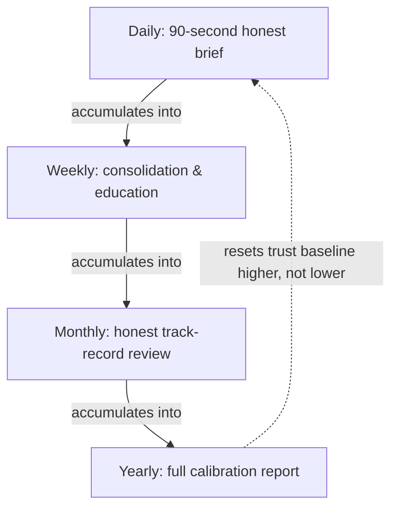

# Retention System
## Office of the Chief Product Officer — Habit Without Manipulation

**Mandate:** Design how ImpactOne becomes a daily habit at one million users without a single manipulative mechanic. This document names, explicitly, what this product refuses to build — because most retention systems in this category are built from a shared playbook of psychological hooks this product's own founding principles already forbid.

---

## What We Refuse to Build

Before designing what retention looks like here, it must be said plainly what it will never be:

- **No variable reward schedules.** A slot-machine-style unpredictable payoff (sometimes exciting news, sometimes nothing, engineered to keep a user checking "just in case") is never used here. A quiet day says it is a quiet day.
- **No streaks for their own sake.** A counter that punishes a missed day with guilt, divorced from any real value delivered that day, is not retention — it's a treadmill. If a streak mechanic is ever used, it must be tied to genuine learning or genuine habit milestones, never to raw days-in-a-row.
- **No fear-based re-engagement.** No "your portfolio needs attention" push unless something genuinely does. Manufacturing anxiety to drive an open is exactly the opposite of this product's mission.
- **No infinite scroll.** Every list this product shows has a real, honest end.
- **No engagement-optimized notification timing.** Notifications are sent when the content is genuinely ready and relevant, on a schedule the user chose — never algorithmically timed to catch a user at their most distractible moment.
- **No dark patterns of any size**, including small ones — a slightly-too-eager referral prompt right after a win is exactly the kind of thing this document exists to prevent, not just the obvious cases.

**The test every retention mechanic must pass:** would this still make sense to build if the goal were "make the user's financial understanding measurably better over a year," rather than "maximize daily opens"? A mechanic that only survives under the second framing does not ship.

---

## Daily

**The mechanic:** the 90-second morning loop (`MORNING_EXPERIENCE_BLUEPRINT.md`), triggered by one user-chosen notification time, containing the actual day's headline rather than a teaser.

**Why it's not manipulation:** the user controls the timing, the content is genuinely new every day (never padded to appear more active than the world actually was), and an honest "nothing urgent today" is a fully valid, frequent, expected outcome — not a bug to be minimized. A product that manufactures a reason to open every single day is lying about how much genuinely happened.

**What makes it durable:** trust compounding — each honest "nothing to report" day makes the eventual "something matters today" day more credible, not less. A user who has seen the platform correctly say nothing important happened ninety times has every reason to take it seriously the ninety-first time it says something did.

---

## Weekly

**The mechanic:** a once-a-week, lower-pressure surface — a short digest of the week's themes, one piece of educational content tied to something in the user's own activity, and (on weekends specifically) an explicit shift away from market-urgency framing entirely.

**Why it's not manipulation:** weekly content is additive, not a repackaging of the same daily items dressed up to look new; it exists to consolidate understanding, not to manufacture a second daily-style hook on a different cadence.

**What makes it durable:** it's the first rhythm beyond the daily loop that reinforces *learning* rather than *checking* — a user who only ever opens for the daily 90 seconds is informed; a user who also engages weekly is becoming more capable over time, which is the actual long-run product this company is building.

---

## Monthly

**The mechanic:** the Monthly Portfolio Review — a dedicated, unhurried surface showing what changed, and grading the platform's own past calls honestly, including the ones that were wrong.

**Why it's not manipulation:** this is the one surface in the entire retention system explicitly designed to sometimes make the platform look bad, on a fixed, predictable schedule, regardless of how that month went. A retention mechanic that only ever flatters itself is a marketing tool wearing a habit's clothing; this one is real specifically because it isn't afraid to be honest at the exact moment honesty is least convenient.

**What makes it durable:** this is the single highest-leverage trust-compounding moment in the entire yearly cycle — a user who has seen twelve consecutive honest monthly reviews, including the misses, has a fundamentally different relationship with this product than a user who has only ever seen good news.

---

## Yearly

**The mechanic:** an annual "what we got right and wrong this year" report — a durable, shareable, honestly-graded summary of the platform's calibration over the full year, alongside a personal reflection of the user's own growth (what they understood at the start of the year versus what they understand now).

**Why it's not manipulation:** it is the platform holding itself accountable at the largest possible scale it operates on, not asking the user for anything in return — no forced action, no artificial deadline, no upsell attached to the moment.

**What makes it durable:** this is the artifact users are most likely to voluntarily share with someone else, specifically because it's genuinely rare for a financial product to publish its own mistakes — and it is the clearest possible proof, once a year, that the daily and monthly honesty wasn't just a policy, it was a pattern that held for twelve consecutive months.

---

## How These Four Cadences Reinforce Each Other

Each longer cadence is built entirely from the honesty of the shorter one beneath it — the yearly report is only as credible as twelve honest monthly reviews, which are only as credible as fifty-two honest weekly digests, which are only as credible as hundreds of honest daily mornings. There is no separate "retention feature" layered on top of the product's honesty; the honesty *is* the retention system, expressed at four different time scales.

---

## Measurement

Retention here is measured the way `MOBILE_PRODUCT_MASTERPLAN.md` and `GROWTH_PLAYBOOK.md` already define it: **Weekly Trust-Confirmed Users** — opens that include at least one honestly-delivered, verifiable claim — not raw session count or time-in-app. A retention system is working when this number rises together with, never at the expense of, average session length falling. A user who needs less time to feel confident is this product's actual success condition, and this entire system is designed to be judged by that standard, not by how long anyone stays on any given day.
