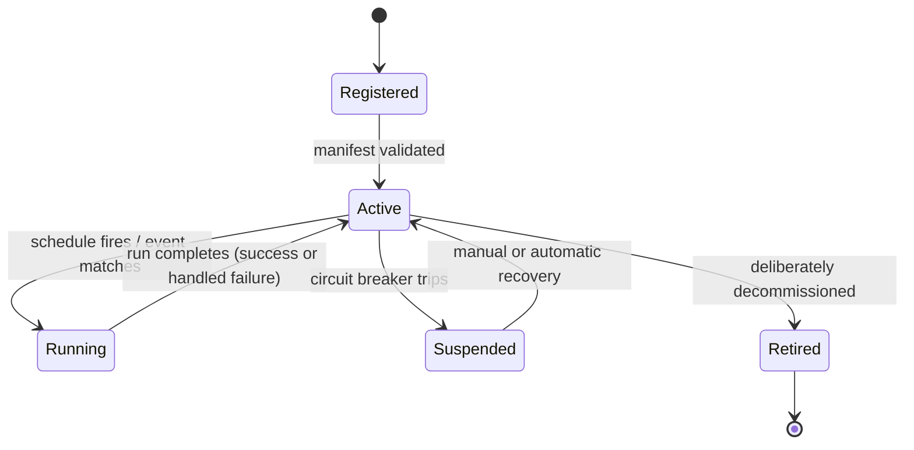

# Agent Platform Architecture

**Phase:** AGENT-ARCHITECTURE-001
**Purpose:** The long-term architecture for running 50+ independent AI agents on this platform. This is a design document — no code was written or changed to produce it. It deliberately builds on real infrastructure this platform has already built (the Intelligence Bus, the provider registry, the Investment Committee, `DecisionTrace`, the Claim Intelligence Layer, `AutonomousRunLog`/`ProviderRunLog`) rather than inventing a parallel system, because this platform's own history — five separate frontend "Workspace" screens converging on one shared architecture, three separate personalization services still waiting to converge on one — has repeatedly shown that the real risk at scale is fragmentation, not a lack of ideas.

---

## The decisive question first: class, service, plugin, worker, or event-driven?

**All five, at different layers — not a single choice, and treating it as one is the most common mistake this design exists to prevent.**

| Layer | Answer | Why |
|---|---|---|
| **Registration & discovery** | **Plugin** | Every agent is discoverable through one manifest-based registry — a direct generalization of this platform's existing `providerRegistry.js`/`providerFactory.js` pattern (15 registered data providers today) and `intelligenceBusRegistry.js`'s `KNOWN_ENGINES`/`KNOWN_CONSUMERS`. At 50+ agents, "which agents exist and what do they do" must be answerable by reading one registry, never by grepping the codebase. |
| **Implementation shape** | **Service (stateless module), not class** | This platform's entire backend — `personalIntelligenceService.js`, `investorMemoryService.js`, `autonomousRecommendationEngine.js`, every service reviewed across this whole engagement — is written as stateless, exported-function modules, never ES classes. An agent should be the same: a module exporting a `run(context)` function and a manifest, not an object with instance state. Statelessness here is not a style preference — it is the precondition for the horizontal scaling and failure isolation sections below. |
| **Coordination between agents** | **Event-driven** | Agents must never call each other directly. They publish real findings (Claims, Events) onto the existing Intelligence Bus and react to events published by others — exactly the "canonical event transport every engine should publish into" the Bus was already designed for. At 50+ agents, direct agent-to-agent calls would recreate the exact N² coupling problem this platform's own frontend architecture work (`intelligenceEngine.js`, `claimPresentation.js`) has spent this whole engagement eliminating one layer up. |
| **Execution** | **Worker** | Each agent run executes as a stateless worker invocation — triggered either by a schedule (cron-style, matching `autonomousRecommendationEngine.js`'s existing `runOnce()` pattern) or by an incoming Bus event. "Worker" here means the unit of execution is disposable and replaceable, not that it requires a separate worker-thread/process on day one (see [AGENT_SCALABILITY.md](../product/AGENT_SCALABILITY.md) for when and how that becomes literal). |

This layered answer is itself the architecture's central discipline: **plugin for identity, service for implementation, event-driven for coordination, worker for execution.** An agent that violates any one of these (a class holding mutable state, a direct call to another agent, a registration that lives only in one engineer's memory) is the kind of drift this design exists to make structurally difficult, not just discouraged in a comment.

---

## Agent lifecycle

Six states, directly modeled on the platform's own already-proven `AutonomousRunLog`/`ProviderRunLog` health-tracking pattern:



- **Registered**: the agent's manifest exists in the registry but has not yet passed validation (schedule syntax, declared dependencies exist, output contract is well-formed).
- **Active**: validated and eligible to run, on schedule or on a matching Bus event.
- **Running**: a specific invocation in progress — always time-boxed (see Failure isolation).
- **Suspended**: automatically removed from scheduling after repeated failures (mirroring `providerHealthService.js`'s existing health tracking, generalized platform-wide), without requiring a code change to pause a misbehaving agent.
- **Retired**: deliberately removed, with its manifest and full run history preserved (never deleted — matching this platform's append-only discipline for `DecisionTrace`/`Recommendation`/every audit-relevant table reviewed this engagement).

## Registration

One **Agent Registry**, generalizing `providerRegistry.js` beyond data providers to cover every reasoning/analysis agent (Options Agent, Investment Committee members, a future 50-agent roster). Each entry is a manifest, not code:

```
{
  agentId: "options-flow-agent",
  version: "1.2.0",
  capability: "analyzes real options-flow signals into Claims",
  trigger: { type: "schedule", cron: "*/15 * * * *" } | { type: "event", eventType: "price.significant-move" },
  priority: "HIGH" | "NORMAL" | "LOW",
  dependencies: ["claims-api", "market-data-provider"],
  timeoutMs: 30000,
  outputContract: "Claim" | "Event",
}
```

The registry is the single place that answers "what agents exist, what do they depend on, how often do they run" — the same problem `KNOWN_ENGINES`/`KNOWN_CONSUMERS` already solves for the Intelligence Bus today, extended to be the actual source of truth the scheduler and dependency-resolver both read from, not just a documentation list.

## Scheduling

A single, central **Scheduler** owns every cron-style trigger — no individual agent manages its own timer. This directly generalizes the existing `node-cron` dependency and `autonomousRecommendationEngine.js`'s scheduled `runOnce()` pattern from "one engine's own loop" to "one shared scheduler reading every Active agent's manifest." At 50+ agents, 50 independent `setInterval`/cron registrations scattered across the codebase is precisely the kind of fragmentation this design must prevent — one scheduler, one place to see the full run calendar, one place to apply global concurrency limits.

Event-triggered agents (reacting to a Bus event rather than a clock) are registered the same way, with the Scheduler subscribing to the Bus on their behalf and invoking them exactly like a cron firing — from the execution layer's perspective, "a schedule fired" and "a matching event arrived" are the same kind of trigger, handled identically.

## Parallel execution

Agents are independent by construction (stateless, Bus-mediated, no direct calls), so parallel execution is safe by default — but **bounded**, never unbounded fan-out. A worker-pool concurrency limit (a real, configured maximum number of simultaneous agent runs) prevents 50 agents' schedules aligning and saturating the database or downstream providers at once. Every batch of concurrent runs uses the same `Promise.allSettled` fault-isolation discipline already proven at the frontend Workspace layer (every Workspace's own data loading) and the backend Intelligence Bus layer — one agent's failure or slowness never blocks or delays another's.

## Async execution

Every agent invocation is async by default and time-boxed (see `timeoutMs` in the manifest). A long-running agent (an LLM-backed report, a multi-step analysis) must checkpoint its own progress rather than holding the Scheduler's attention for the whole duration — the Scheduler dispatches and moves on; the agent reports completion (or intermediate progress, see Streaming) asynchronously via the Bus, exactly like every existing async service call in this codebase already does.

## Streaming

Agents do not need to know about transport. An agent whose output is naturally progressive (a multi-section AI report, a long analysis) emits **incremental Events** onto the Bus as sections complete, tagged with a correlation ID for the overall run. A separate, thin streaming gateway (already a natural extension of this platform's existing SSE/WebSocket-capable API layer) subscribes to those correlation-tagged events and relays them to any connected client — the agent's own code is identical whether zero, one, or a hundred clients are currently watching.

## Priorities

Two genuinely distinct concepts, and this platform's own hard-won history (the Attention/Confidence/Status badge-tone collision, found and fixed earlier in this engagement) is the direct reason to keep them separate here too:
- **Scheduling priority** (`Critical`/`High`/`Normal`/`Low` on the agent's own manifest) — governs which agent gets worker-pool capacity first under load. This is about the platform's own operational concerns.
- **Output priority** (the real, already-established Attention Score on whatever Claim/Event the agent produces) — governs how much a human should care about the *result*. This is about the user's concerns.

An agent scheduled at `Critical` priority can still produce a Low-Attention result, and a `Normal`-priority agent can produce something genuinely urgent. Conflating the two — letting an agent's scheduling importance leak into how urgent its output looks to a user — is exactly the kind of drift this platform has already paid down once and should not reintroduce here.

## Failure isolation

Every agent run is wrapped in the same three real disciplines already proven elsewhere in this platform:
1. **Timeout** — a run that exceeds its manifest's `timeoutMs` is killed and marked `TIMED_OUT`, never allowed to hang the worker pool.
2. **Try/catch at the boundary** — an agent's own internal errors are caught at the Scheduler's dispatch boundary and logged to a generalized `AgentRunLog` (the same shape as the existing `AutonomousRunLog`/`ProviderRunLog`), never propagated to crash the Scheduler process.
3. **Circuit breaker** — an agent with a real, sustained failure rate (mirroring `providerHealthService.js`'s existing `lastRunAt`/`lastStatus`/successRate tracking) is automatically moved to `Suspended`, removed from scheduling until manually or automatically re-enabled — a misbehaving agent degrades gracefully to "not running" rather than repeatedly failing loudly or corrupting shared state.

## Caching

A shared, structured Agent Cache generalizes the frontend's `requestCache.js` pattern to the backend — with the one correction this platform's own recent architecture review already identified as a real risk in the original: **cache keys must be structurally derived from the actual call parameters, never hand-written strings a future caller could accidentally mismatch.** A key-builder function (`buildCacheKey(agentId, params)`) replaces string literals entirely, closing the exact drift risk (`"claims:overnight-changes:10"` duplicated as an unlinked constant in multiple frontend files) already found and tracked in [PLATFORM_TECH_DEBT.md](PLATFORM_TECH_DEBT.md) before it can recur at the agent layer.

## Memory

Three distinct tiers, matching real, already-differentiated storage this platform has built rather than inventing a fourth:
1. **Run-scoped working memory** — an agent's own scratch state for the duration of one invocation, discarded on completion. Never persisted, never shared.
2. **Personal Memory** — the existing, now correctly user-scoped `UserMemoryEvent`/Investor Memory layer. Agents may *read* this (with a real `betaUserId`, per the just-verified privacy fix) to personalize their own reasoning; they never maintain a second, competing copy of it.
3. **World Memory** — the platform's existing durable, cross-agent lesson store (`WorldMemoryRecord`/`WorldMemoryLesson`/`WorldMemoryCausalLink`, append-only). Agents contribute lessons here through one defined, append-only write path — never an ad hoc table a single agent invents for itself.

## Explainability

Every agent run produces a real, immutable record — the same `DecisionTrace` discipline already proven for recommendations — capturing real inputs, the real reasoning path, real outputs, and a real confidence value, queryable after the fact. An agent whose output cannot be traced back to a specific run record is not production-eligible under this architecture, full stop; this mirrors the platform's own "committee debates, never decides silently" and "never fabricate, always evidence-backed" standards, applied to agent infrastructure instead of individual recommendations.

## Shared context

A backend-side analogue to the frontend's `PlatformContext` — not the same object, but the same idea at the right layer: every agent run carries a **Run Context** (a correlation ID, the triggering event or schedule tick, any relevant Claim/symbol IDs already in scope) so a chain of related agent activity (an event triggers Agent A, which produces a Claim that triggers Agent B) can be traced as one coherent thread, not a set of disconnected log lines. This is deliberately *not* a shared mutable global — it is an immutable, passed-down context object, matching the read-only, request-scoped shape `req.betaUserId` already takes through this platform's controllers.

## Plugin architecture

The registry (above) *is* the plugin architecture — every agent is a plugin by definition, discoverable, versioned, and swappable without touching the Scheduler's own code. Adding agent #51 should require exactly one new manifest entry and one new service module, never a change to shared infrastructure — the same "adding a sixth Workspace required zero changes to the shared frontend foundation" proof point this platform has already demonstrated three times over should hold here too.

---

See [AGENT_SCALABILITY.md](../product/AGENT_SCALABILITY.md) for how this architecture behaves at 50+ agents and beyond a single process, and [AGENT_BEST_PRACTICES.md](../product/AGENT_BEST_PRACTICES.md) for the practical guide to building one new agent correctly.
