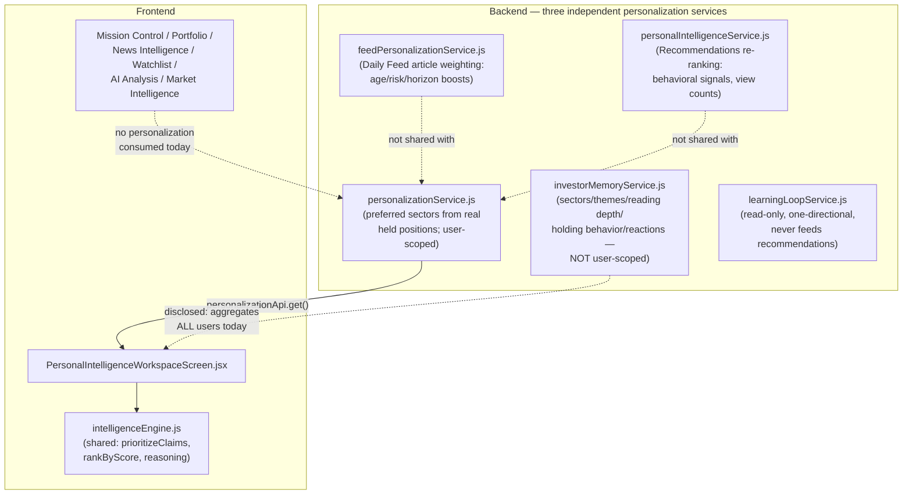

# Personalization Architecture

**Phase:** PERSONAL-INTELLIGENCE-REVIEW-001
**Purpose:** The target architecture Personal Intelligence should converge on before it expands further — building on the genuine strengths found in [PERSONAL_INTELLIGENCE_REVIEW.md](../archive/audits/PERSONAL_INTELLIGENCE_REVIEW.md) and closing the gaps in [PERSONAL_INTELLIGENCE_GAPS.md](../planning/PERSONAL_INTELLIGENCE_GAPS.md). This is a description of what should exist, not a review of what does — no code was written or changed to produce it.

---

## The current architecture, mapped

The dotted lines are the gaps: three backend services that should share one model don't; six of seven Workspaces don't consume personalization at all; and the one service feeding this Workspace's future "memory" features isn't user-scoped.

## Target architecture

### 1. One canonical User Preference Profile, not three
Consolidate `feedPersonalizationService.js`, `personalIntelligenceService.js`, and `personalizationService.js`'s preference-computation logic into a single, canonical backend concept — a `UserPreferenceProfile` (name illustrative, not prescriptive) that answers, in one place: preferred sectors, preferred asset types, risk tolerance, investment horizon, and preferred recommendation style. Each of the three current consumers (Daily Feed ranking, Recommendations re-ranking, the Personal Intelligence Workspace) should read from this one model rather than each computing its own version. This mirrors, on the backend, exactly the consolidation the frontend already completed with `claimPresentation.js` and `intelligenceEngine.js` — the same discipline, applied to the same class of problem, one layer down.

This does not mean the three services' *distinct* weighting logic (Daily Feed's age/horizon boosts, Recommendations' behavioral re-ranking) must be unified — those are legitimately different presentation-layer concerns consuming the same underlying preferences. What should be unified is the *preference data itself*, not necessarily how each consumer weights it.

### 2. `investorMemoryService.js` must be user-scoped before anything else
This is the precondition for every other item in this document. Every function it calls — `getSectorInterestSummary`, `getThemeInterestSummary`, `getRecommendationViewCounts`, `listAllFeedback` — needs a real `betaUserId` parameter threaded through, following the exact discipline `personalizationService.js` already establishes correctly (`requireBetaUser`, filtered Prisma queries). No expansion of Personal Intelligence — especially any future recommendation-engine integration — should proceed while this remains unscoped, since every new consumer of "Investor Memory" data would otherwise inherit the same cross-user leakage.

### 3. Personalization as a platform-wide signal, not a single-screen feature
Once the canonical preference model exists (item 1), it should be threaded through the same shared consumption pattern every other cross-cutting concern in this platform already uses:
- Exposed via `PlatformContext` (or a sibling, purpose-built hook) so any Workspace can read the current user's real preferences without its own fetch.
- Consumed by `intelligenceEngine.js`'s existing ranking functions as an optional weighting input (e.g., `prioritizeClaims(claims, { preferenceProfile })`), so personalization becomes a parameter to the platform's one shared ranking logic rather than a parallel, Workspace-specific filter reimplemented per screen.
- Applied consistently to Mission Control's Today's Brief, Portfolio Workspace's claim ranking, News Intelligence's coverage selection, and Watchlist Workspace's priorities — the same real signal, in the same place, everywhere it's relevant, exactly like Claims and Attention Score already are.

### 4. A deliberate, explicit decision point for closing the recommendation-learning loop
`learningLoopService.js`'s current read-only, one-directional boundary is sound and should not be casually removed — the platform's own stated reason (never let immediate feedback bias today's recommendations) is a legitimate safeguard, not just caution. Before any future phase connects `investorMemoryService.js`'s (by-then user-scoped) signals into `autonomousRecommendationEngine.js` or `personalIntelligenceService.js`, that decision should be made explicitly, documented, and gated behind real evaluation (a minimum sample size, a held-out validation approach) — not introduced quietly as a side effect of an unrelated feature. This mirrors the same discipline this platform has already applied everywhere else data quietly influences a user-facing verdict.

### 5. Cache-key discipline that accounts for per-user data
Every `requestCache` key used for personalization or investor-memory data should include the user identity as part of the key (or the cache should be explicitly documented as intentionally shared/non-personal). `personalization:profile` should become `personalization:profile:${betaUserId}` (or equivalent); the watchlist-priority key fragmentation issue is lower priority but worth the same review once the cache is being extended to more consumers.

---

## Sequencing

1. **Fix `investorMemoryService.js`'s user-scoping first, before any other item on this list.** This is a real, active privacy gap, not a design preference — everything else here should wait for it, not be sequenced alongside it.
2. **Consolidate the three backend personalization services into one canonical preference model**, since every subsequent platform-wide integration step becomes easier (and safer) once there's one thing to integrate rather than three.
3. **Thread personalization through `PlatformContext`/`intelligenceEngine.js` and into the remaining six Workspaces**, following the exact pattern that has already proven itself for Market Intelligence and every other cross-cutting concern in this platform's recent history.
4. **Only then**, as its own explicitly-scoped and separately-evaluated phase, consider connecting `learningLoopService.js`'s signals into real recommendation generation — with the user-scoping from step 1 and the consolidated model from step 2 both already in place as preconditions, not assumptions.

## What should not change

- The core personalization principle already established and verified in this review — reorder and narrate, never fabricate or alter underlying facts, confidence, or evidence — is correct and should govern every future expansion exactly as it governs the current implementation.
- The Personal Intelligence Workspace's own honesty discipline (no-profile gating, honest empty states, per-section Demo Mode) is a genuine strength and should be the template every newly-personalized Workspace section follows, not something to revisit.
