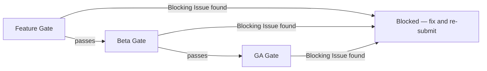

# ImpactOne Release Gates

**Phase:** RELEASE-GATE-001
**Purpose:** Defines *how* [IMPACTONE_RELEASE_CHECKLIST.md](IMPACTONE_RELEASE_CHECKLIST.md) is actually enforced — the gate tiers a feature must pass through, who or what evaluates each gate, and what happens when a Blocking Issue is found. The Checklist is the standard; this document is the process that applies it.

---

## Why a tiered gate, not one single gate

Not every change carries the same risk, and not every stage of the product needs the same scrutiny. A copy tweak on a settings screen and a rebuilt Mission Control home screen do not warrant the same process. Three gates are defined below, each stricter than the last, corresponding to how much real-user exposure the change is about to get.

---

## Gate 1 — Feature Gate (merge into main)

**Applies to:** every pull request / merge into the main branch, regardless of size.

**Evaluated against:** the Mandatory tier of every relevant Checklist category (not every category applies to every change — e.g. a backend-only change is not evaluated against Mobile Readiness, but *is* evaluated against Data Integrity and Error Handling).

**Who/what evaluates it:**
- Automated: full test suite, lint, and any CI-enforced checks (§10 Production Readiness's "test suite runs before merge" is itself a Feature Gate requirement, not optional).
- Human or agent review: a reviewer independent of the author confirms the relevant Mandatory items, using [IMPACTONE_DEFINITION_OF_DONE.md](../product/IMPACTONE_DEFINITION_OF_DONE.md) as the working checklist.

**Outcome:**
- Pass → merges to main.
- Any Blocking Issue present → merge is refused. No exceptions, no "fix it in a follow-up" — a Blocking Issue found at this gate does not enter main.

---

## Gate 2 — Beta Gate (real users, any cohort size)

**Applies to:** any change that will be shown to real users, even a small private cohort, even without a formal "launch."

**Evaluated against:** the full Checklist — Mandatory items across *all ten* categories, not just the ones judged relevant at the Feature Gate. A change that looked fine in isolation can still fail here once it's evaluated as part of the whole live product (e.g. a new screen that individually passes UX Quality can still fail Mobile Readiness in landscape, or fail AI Honesty once its scores are compared side-by-side against a sibling screen's).

**Method — this is a live-verification gate, not a documentation gate:**
- The evaluator must open the actual running product and interact with it directly (click through real flows, resize to real breakpoints including phone-landscape, force an offline/error state, compare outputs across at least two different inputs side-by-side) — not just read the diff or trust a completion report.
- Every Blocking Issue found in a previous Beta Gate review must be explicitly re-tested live and confirmed fixed, not assumed fixed because a commit message says so. A defect is only closed once independently re-observed as absent.

**Outcome:**
- Pass → cleared for the intended beta cohort, at the intended size.
- Any Blocking Issue found (new, or a previously-flagged one not actually fixed) → not cleared for beta at any cohort size. Partial fixes do not unlock a smaller cohort as a compromise — Blocking Issues are binary.

---

## Gate 3 — GA Gate (general production release)

**Applies to:** removing the "beta" label, opening the product to unrestricted signups, or any change to a feature that is already GA.

**Evaluated against:** the full Checklist at both the Mandatory and Recommended tiers. Recommended items that remain open must be explicitly listed and consciously accepted as known gaps, not silently skipped — this gate requires a written record of what's deferred and why, not just a pass/fail.

**Additional requirement unique to this gate:** a minimum observation window with zero new Blocking Issues found across at least two independent review sessions, run far enough apart to catch intermittent or load-dependent defects (this product's own history includes defects — the phone-landscape sidebar regression, false portfolio-overlap claims — that were fixed, then silently reintroduced, then only caught because a later, independent session re-tested rather than assumed the earlier fix still held).

**Outcome:**
- Pass → general release.
- Any Blocking Issue, or a Recommended-tier gap with no documented rationale for deferring it → not ready for GA.

---

## Handling regressions and previously-closed issues

Several real defects in this product's history were fixed once, then reappeared later without anyone reintroducing them on purpose (e.g., a layout bug reproducing only at one specific aspect ratio that wasn't retested; a false data claim that returned once account state changed). Because of this pattern:

- **No Blocking Issue is ever marked "resolved" from a code diff alone.** Resolution requires a fresh, independent, live re-test that reproduces the original failing condition and confirms it no longer occurs.
- **Every closed Blocking Issue is retested at the next Beta Gate and GA Gate review it's eligible for**, not just once at the moment it was closed. A regression that reappears is treated as a brand-new Blocking Issue, not a reopened low-priority ticket.

## Exceptions

There are no exceptions to a Blocking Issue at any gate. "Ship now, fix later" is not an available path for anything in the Blocking Issues list of the Checklist — that list exists specifically to name the failures severe enough that no business justification overrides them. Anything not on the Blocking Issues list (i.e., Recommended or Nice to have items) can be consciously deferred with a documented reason; Blocking Issues cannot.
